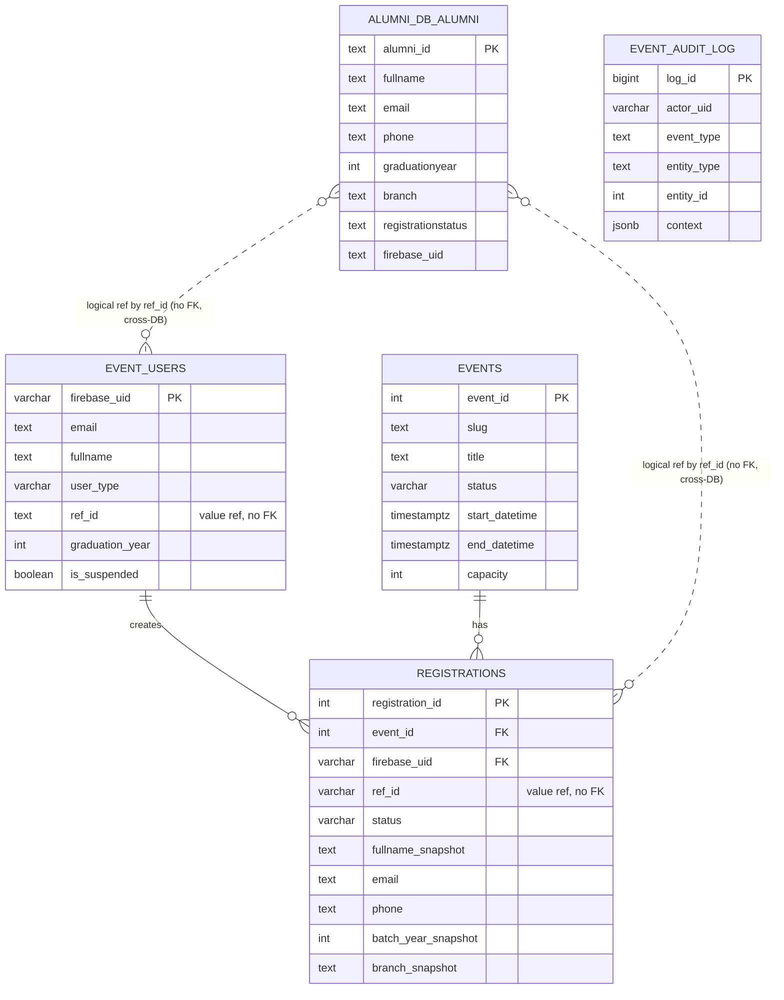
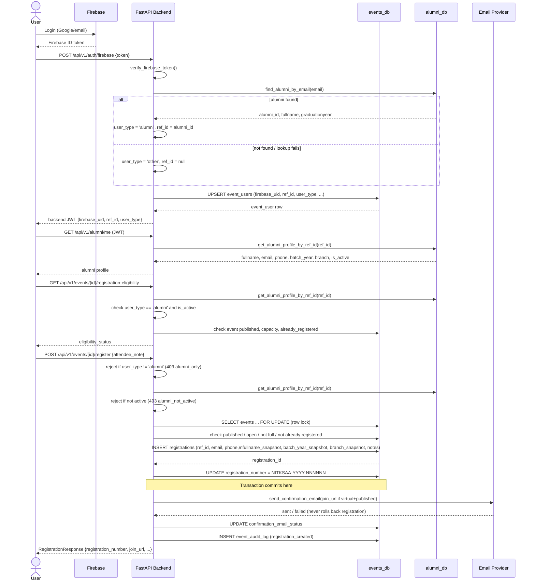
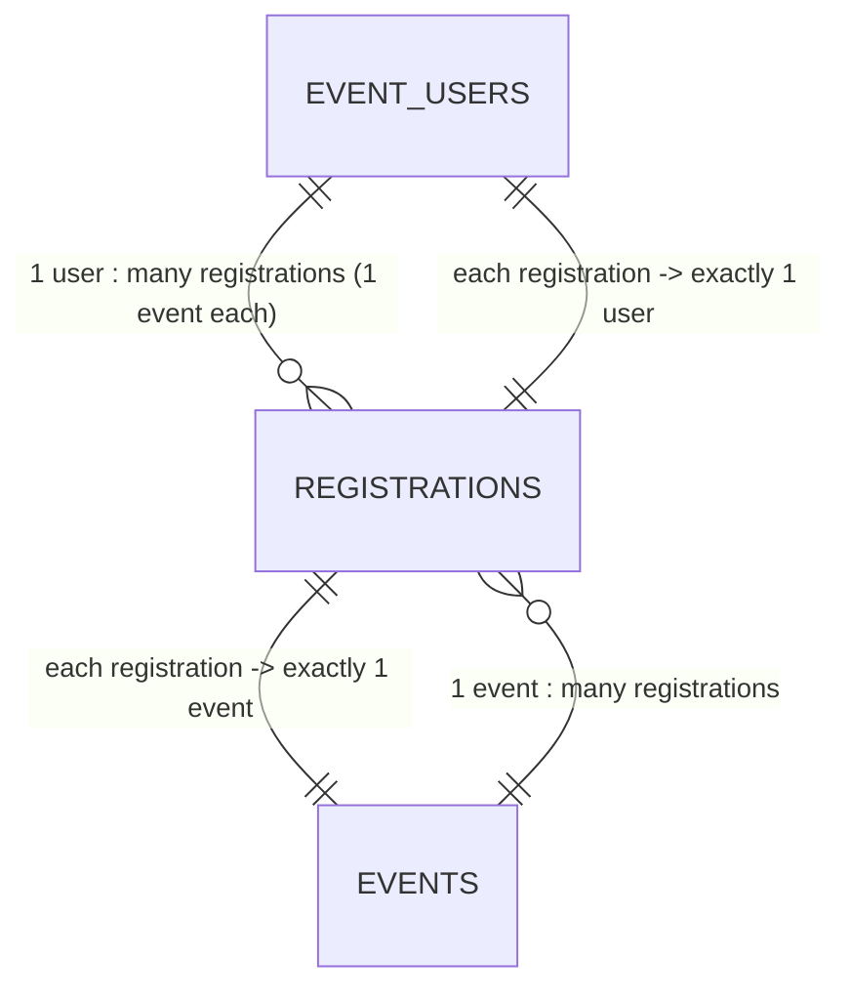
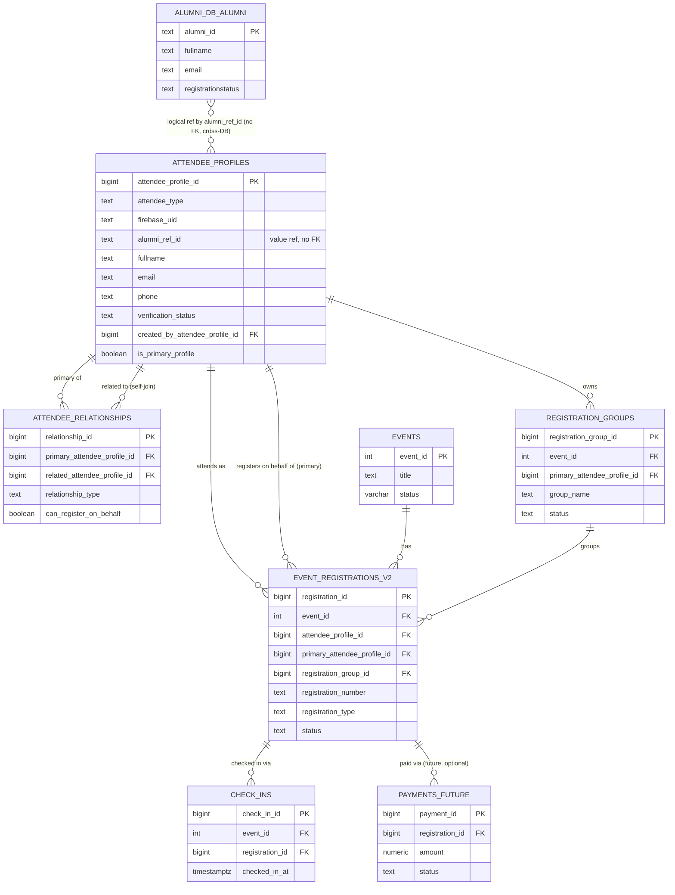
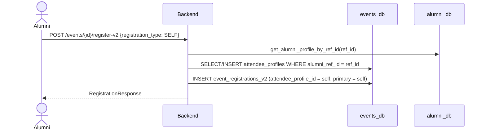
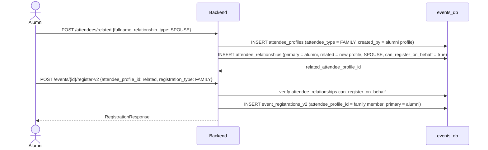
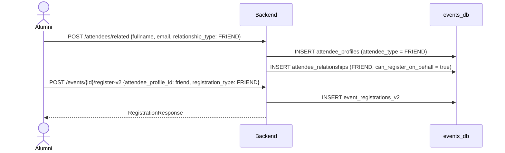
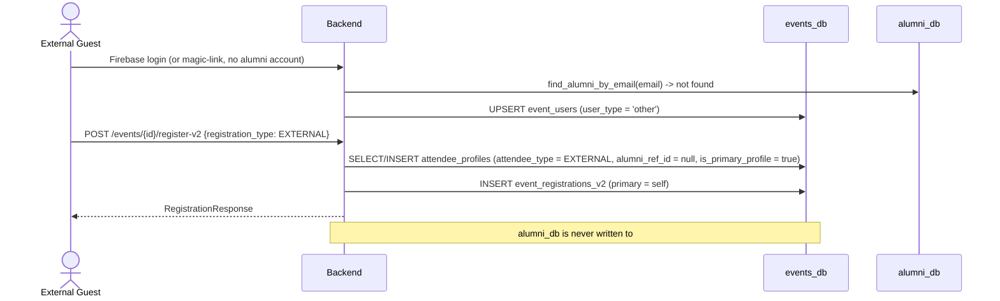
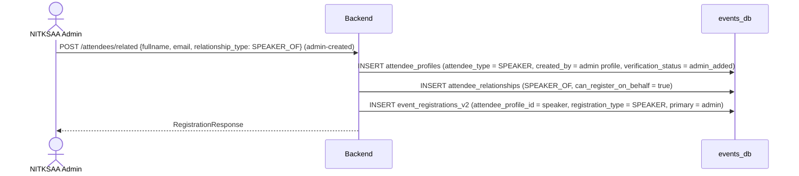

# NITKSAA Event Platform — Database Relationship Diagrams v1

**Date:** 2026-07-04
**Status:** Draft for review
**Scope:** `alumni_db` ↔ `events_db` relationship, current registration flow, and future attendee model

This document is grounded in the current backend code (`backend/app/models` — repositories, services,
schemas, migrations under `backend/migrations/events_db/`). Where the code contains an unresolved
inconsistency, it is flagged here rather than papered over. See the companion document
[`db_relationship_diagrams_review_notes.md`](db_relationship_diagrams_review_notes.md) for the full
list of assumptions, unknowns, and questions for the backend owner.

---

## 1. Executive Summary

**Current state.** `alumni_db` (owned by `nitksaa-portal-v2`) is the single source of truth for
alumni identity. `nitksaa-event` reads it through a dedicated read-only connection pool
(`get_alumni_pool()`), never writes to it, and copies a handful of fields into `events_db.registrations`
at registration time as immutable **snapshot columns**. The two databases are linked only by a
**value reference** — `events_db.registrations.ref_id` / `event_users.ref_id` store
`alumni_db.alumni.alumni_id` as plain text. There is no cross-database foreign key, and none is
technically possible since the two databases are separate Postgres instances/schemas.

Registration today is **alumni-only**: `POST /api/v1/events/{event_id}/register` rejects any
`event_user` whose `user_type != 'alumni'`. There is no first-class "attendee" entity distinct from
"the alumni who registered" — one `registrations` row is both the registration and the only record
of who is attending.

**Target state.** To support family members, friends, guests, speakers, and external (non-alumni)
attendees, `events_db` needs its own attendee identity table
(`attendee_profiles`) decoupled from `alumni.alumni_id`, plus a self-referencing
`attendee_relationships` table so an alumnus can register people connected to them without ever
writing those people into `alumni_db`. `alumni_db` remains the alumni identity master; `events_db`
becomes the event-attendee master for everyone else.

---

## 2. Database Ownership

| Database | Owner | Purpose | Write Access |
|---|---|---|---|
| `alumni_db` | `nitksaa-portal-v2` | Master alumni identity | Event app read-only |
| `events_db` | `nitksaa-event` | Events and registrations | Event app read/write |

---

## 3. Current Logical DB Relationship

`alumni_db` and `events_db` are two independent Postgres databases connected through two separate
asyncpg pools (`get_pool()` for `events_db`, `get_alumni_pool()` for `alumni_db`,
`backend/app/database.py`). The relationship is **logical/value-based only**:

- `events_db.event_users.ref_id` = `alumni_db.alumni.alumni_id` (text equality, no FK)
- `events_db.registrations.ref_id` = `alumni_db.alumni.alumni_id` (text equality, no FK)
- Snapshot columns (`fullname_snapshot`, `email`/`email_snapshot`, `phone`/`phone_snapshot`,
  `batch_year_snapshot`, `branch_snapshot`) are copied into `registrations` at INSERT time and never
  re-synced.



> `..` dotted relationships denote a **value reference across database boundaries** — enforced only
> in application code (`alumni_service.get_alumni_profile_by_ref_id`), never by the database engine.

`check_ins` is intentionally omitted from this diagram — see [§7](#7-current-limitations) and the
review notes: the live `check_ins`/check-in code path (`checkin_repository.py`,
`checkin_service.py`) targets a different, older table shape than the one created by the applied
migration sequence, so its current real-world schema is unverified.

---

## 4. Current Registration Flow



`join_url` is only ever populated when `status == 'registered' AND event.is_virtual AND
event.status == 'published'` (`registration_service._resolve_join_url`) — it is never present in
public/unauthenticated event responses.

---

## 5. Current Table Relationship Explanation

### `alumni_db.alumni` (external, read-only)
- **Purpose:** Master alumni identity, owned by `nitksaa-portal-v2`.
- **Primary key:** `alumni_id` (text).
- **Foreign keys:** none relevant to `nitksaa-event`.
- **Logical references:** referenced by value from `events_db.event_users.ref_id` and
  `events_db.registrations.ref_id`.
- **Snapshot behavior:** N/A — this table is the *source* of snapshot data, never the target.
- **Columns actually read by nitksaa-event:** `alumni_id`, `fullname`, `email`, `phone`,
  `graduationyear`, `branch`, `registrationstatus`, and `firebase_uid` (read in
  `get_alumni_profile_by_ref_id` but not currently used downstream — see review notes).

### `events_db.event_users`
- **Purpose:** Maps a Firebase identity to an event-platform user and caches identity type.
- **Primary key:** `firebase_uid`.
- **Foreign keys:** none (referenced *by* `event_members` and `registrations`).
- **Logical references:** `ref_id` → `alumni_db.alumni.alumni_id` (value only).
- **Snapshot behavior:** none — `event_users` fields (`fullname`, `email`, `graduation_year`) are
  live-updated on every login (`ON CONFLICT ... DO UPDATE`) as long as `user_type == 'alumni'`;
  they are not frozen at any point in time. This is distinct from `registrations`, which does
  freeze a snapshot.

### `events_db.events`
- **Purpose:** Event definitions (schedule, capacity, virtual/physical, registration window).
- **Primary key:** `event_id`.
- **Foreign keys:** none outward; `sessions`, `registrations`, `event_members`,
  `check_ins` reference it inward.
- **Logical references:** none.
- **Snapshot behavior:** N/A.

### `events_db.registrations`
- **Purpose:** One row per registration attempt; today this is also the *only* record of the
  attendee (there is no separate attendee entity in the live schema).
- **Primary key:** `registration_id`.
- **Foreign keys:** `event_id → events.event_id` (CASCADE), `firebase_uid → event_users.firebase_uid`.
- **Logical references:** `ref_id → alumni_db.alumni.alumni_id` (value only, nullable).
- **Snapshot behavior:** `fullname_snapshot`, `batch_year_snapshot`, `branch_snapshot` are populated
  once at INSERT from the `alumni_db` profile and never updated again. `email` and `phone` columns
  double as the email/phone snapshot (API layer aliases them to `email_snapshot`/`phone_snapshot`;
  see `registration_repository.py` header comment — no separate `email_snapshot` column exists).
  A partial unique index (`uq_registrations_active`, `WHERE status = 'registered'`) allows
  cancel → re-register cycles while preventing two simultaneous active registrations for the same
  `(event_id, firebase_uid)`.

### `events_db.event_audit_log`
- **Purpose:** Append-only audit trail for sensitive actions (registration created, admin edits, etc).
- **Primary key:** `log_id`.
- **Foreign keys:** none (soft `entity_type`/`entity_id` pointer, not enforced).
- **Logical references:** `entity_id` points at rows in other tables depending on `entity_type`.
- **Snapshot behavior:** `context` (JSONB, migration 009) carries structured metadata but by policy
  must **never** contain `firebase_uid`, `email`, `phone`, or join URLs.

### `events_db.check_ins` — **status unverified, excluded from the confident diagram**
Two incompatible definitions of this table exist in the migrations directory (see review notes
§"Two competing schema tracks"). The version actually wired into live code
(`checkin_repository.py`, mounted via `admin_events.py`) expects columns (`attendee_id`, `qr_token`,
`checked_in_at`, `method`) and a companion `attendee_id`-bearing `RegistrationRepository` API
(`get_by_token`, `get_attendee_by_registration`, `set_registration_status`) that **do not exist**
in the `RegistrationRepository` actually shipped (`backend/app/repositories/registration_repository.py`,
Week 3 schema). This strongly suggests the check-in vertical is currently broken against the schema
the rest of the app uses. Treat any check-in diagram as aspirational, not current, until this is
resolved with the backend owner.

---

## 6. Current Registration Cardinality

- One `alumni` (via `event_users`/`ref_id`) can register for **many** events (one active
  `registrations` row per event, enforced by the partial unique index).
- One `event` has **many** `registrations`.
- One Firebase user maps to **exactly one** `event_users` row (`firebase_uid` is the PK).
- One `event_users` row can create **many** `registrations` (across different events; at most one
  *active* registration per event).
- Each `registrations` row belongs to **exactly one** `event` and **exactly one** `event_users`.
- Each `registrations` row stores its own immutable snapshot fields — snapshots are 1:1 with the
  registration, not shared or normalized.



---

## 7. Current Limitations

- **Alumni-only registration.** `register_for_event` hard-rejects any `user_type != 'alumni'` with
  `403 alumni_only`. There is no code path for a non-alumni to register at all today.
- **No first-class attendee profile.** `registrations` conflates "who is attending" with "the
  registration event" — there is no entity representing a person independent of a specific
  registration.
- **Non-alumni are not persistently modeled.** `event_users.user_type = 'other'` exists for
  non-alumni Firebase logins, but nothing downstream uses it for registration; there is no
  `attendee_profiles`-equivalent table for them.
- **Family/friends/guests are not modeled at all.** No schema or API surface exists for "register
  someone else."
- **No relationship between attendees is modeled.** There is no self-join or any table expressing
  "person A is related to / registering on behalf of person B."
- **No group registration model.** Registration is strictly 1 event_user : 1 registration : 1 event.
- **No cross-event guest identity.** A non-alumni guest who attends two different events would have
  no way to be recognized as the same person across events (no stable non-alumni identity key).
- **Cross-DB relationship is not enforced by FK.** `ref_id` correctness depends entirely on
  application code; nothing prevents a stale or malformed `ref_id` from being written to
  `events_db`.
- **Check-in schema is in an unverified/likely-broken state** — see §5 and the review notes.

---

## 8. Future Target Architecture

```
events_db.attendee_profiles          -- event-attendee master (alumni + non-alumni)
events_db.attendee_relationships     -- self-join: who registered whom, and how
events_db.event_registrations_v2     -- registration row, keyed to attendee_profile not event_users
events_db.registration_groups        -- optional: group a primary + their guests under one booking
```

### `attendee_profiles`

| Column | Type | Notes |
|---|---|---|
| `attendee_profile_id` | PK | Surrogate key, stable across events |
| `attendee_type` | enum | `ALUMNI`, `FAMILY`, `FRIEND`, `GUEST`, `SPEAKER`, `EXTERNAL` |
| `firebase_uid` | nullable | Set if this profile ever logs in directly |
| `alumni_ref_id` | nullable | Value ref to `alumni_db.alumni.alumni_id`; set only for `ALUMNI` |
| `fullname` | text | |
| `email` | text | |
| `phone` | text | |
| `verification_status` | text | e.g. `unverified`, `alumni_verified`, `admin_added` |
| `created_by_attendee_profile_id` | nullable, self-FK | Which alumni profile created this record |
| `is_primary_profile` | boolean | True for the profile owning the Firebase login |
| `created_at` / `updated_at` | timestamptz | |

### `attendee_relationships`

| Column | Type | Notes |
|---|---|---|
| `relationship_id` | PK | |
| `primary_attendee_profile_id` | FK → attendee_profiles | The alumni (or acting party) |
| `related_attendee_profile_id` | FK → attendee_profiles | The dependent/guest profile |
| `relationship_type` | enum | `SELF`, `SPOUSE`, `CHILD`, `PARENT`, `FRIEND`, `COLLEAGUE`, `GUEST_OF`, `SPEAKER_OF` |
| `can_register_on_behalf` | boolean | Authorization gate for the register-v2 flow |
| `created_at` | timestamptz | |

### `event_registrations_v2`

| Column | Type | Notes |
|---|---|---|
| `registration_id` | PK | |
| `event_id` | FK → events | |
| `attendee_profile_id` | FK → attendee_profiles | Who is attending |
| `primary_attendee_profile_id` | FK → attendee_profiles, nullable | Who registered them (null if self) |
| `registration_group_id` | FK → registration_groups, nullable | |
| `registration_number` | unique | Same format as today |
| `registration_type` | enum | `SELF`, `FAMILY`, `FRIEND`, `GUEST`, `SPEAKER`, `EXTERNAL` |
| `status` | text | Same lifecycle as today (`registered`/`cancelled`/...) |
| snapshot fields | text/int | Same immutability contract as today's `registrations` |
| `registered_at` | timestamptz | |

### `registration_groups` (optional)

| Column | Type | Notes |
|---|---|---|
| `registration_group_id` | PK | |
| `event_id` | FK → events | |
| `primary_attendee_profile_id` | FK → attendee_profiles | |
| `group_name` | text | e.g. "Sudarshana Karkala + family" |
| `status` | text | |
| `created_at` | timestamptz | |

---

## 9. Future ER Diagram



---

## 10. Future Registration Flows

### A. Alumni registers self



### B. Alumni registers a family member



### C. Alumni registers a friend/guest



### D. External non-alumni registers self



### E. Speaker / guest-of-honour registration



---

## 11. Self-Join Relationship Model

`attendee_relationships` is a self-referencing table over `attendee_profiles`:
`primary_attendee_profile_id` and `related_attendee_profile_id` both point at
`attendee_profiles.attendee_profile_id`. This is the mechanism that lets one alumni-owned identity
"fan out" into everyone they might register, without ever creating rows in `alumni_db`.

| primary_attendee_profile | related_attendee_profile | relationship_type | can_register_on_behalf |
|---|---|---|---|
| Sudarshana Karkala | Sudarshana Karkala's spouse | `SPOUSE` | true |
| Sudarshana Karkala | Sudarshana Karkala's child | `CHILD` | true |
| Sudarshana Karkala | Sudarshana Karkala's friend | `FRIEND` | true |
| NITKSAA Admin | Guest speaker | `SPEAKER_OF` | true |
| External Guest | External Guest (itself) | `SELF` | true |

An `attendee_profile` with `attendee_type = EXTERNAL` can also have a `SELF` relationship row
pointing to itself — this keeps the "who registered whom" query uniform (`JOIN
attendee_relationships ON primary = X`) even for people who registered themselves, instead of
needing a null-check special case.

**Why this avoids storing non-alumni in `alumni_db`:** every person who is not an alumnus
(spouse, child, friend, external guest, speaker) lives entirely inside `events_db.attendee_profiles`.
`alumni_ref_id` on their profile row is simply `NULL`. `alumni_db` never has to know these people
exist, which keeps its schema (owned by `nitksaa-portal-v2`) untouched and keeps `nitksaa-event`'s
promise of being a read-only consumer intact.

---

## 12. Data Examples

### A. Alumni self registration

| attendee_profile_id | attendee_type | alumni_ref_id | fullname | created_by_attendee_profile_id | is_primary_profile |
|---|---|---|---|---|---|
| 101 | ALUMNI | NITK2026IT001 | Sudarshana Karkala | null | true |

| registration_id | attendee_profile_id | primary_attendee_profile_id | registration_type |
|---|---|---|---|
| 5001 | 101 | 101 | SELF |

### B. Alumni registering spouse

| attendee_profile_id | attendee_type | alumni_ref_id | fullname | created_by_attendee_profile_id | is_primary_profile |
|---|---|---|---|---|---|
| 102 | FAMILY | null | Anjali Karkala | 101 | false |

| relationship_id | primary_attendee_profile_id | related_attendee_profile_id | relationship_type | can_register_on_behalf |
|---|---|---|---|---|
| 9001 | 101 | 102 | SPOUSE | true |

| registration_id | attendee_profile_id | primary_attendee_profile_id | registration_type |
|---|---|---|---|
| 5002 | 102 | 101 | FAMILY |

### C. Alumni registering a friend

| attendee_profile_id | attendee_type | alumni_ref_id | fullname | created_by_attendee_profile_id |
|---|---|---|---|---|
| 103 | FRIEND | null | Rakesh Shetty | 101 |

| registration_id | attendee_profile_id | primary_attendee_profile_id | registration_type |
|---|---|---|---|
| 5003 | 103 | 101 | FRIEND |

### D. External guest registration

| attendee_profile_id | attendee_type | alumni_ref_id | fullname | is_primary_profile |
|---|---|---|---|---|
| 104 | EXTERNAL | null | Priya Nair | true |

| registration_id | attendee_profile_id | primary_attendee_profile_id | registration_type |
|---|---|---|---|
| 5004 | 104 | 104 | EXTERNAL |

### E. Speaker registration

| attendee_profile_id | attendee_type | alumni_ref_id | fullname | created_by_attendee_profile_id | verification_status |
|---|---|---|---|---|---|
| 105 | SPEAKER | null | Dr. Vikram Rao | (admin profile id) | admin_added |

| registration_id | attendee_profile_id | primary_attendee_profile_id | registration_type |
|---|---|---|---|
| 5005 | 105 | (admin profile id) | SPEAKER |

---

## 13. Migration Strategy

The current registrations table and flow must not be disturbed before the July 10 demo.

**Phase 0 — Now.** Keep `events_db.registrations` and the alumni-only flow exactly as-is.

**Phase 1.** Add `attendee_profiles`. Backfill one row per distinct `(ref_id)` from `event_users` +
historical `registrations`, with `attendee_type = ALUMNI`, `alumni_ref_id = ref_id`,
`is_primary_profile = true`. This is purely additive — no existing table is altered.

**Phase 2.** Add `attendee_relationships`. Initially empty; populated only as the
register-on-behalf UI ships.

**Phase 3.** Add `event_registrations_v2` (new table, not a rewrite of `registrations`) or extend
`registrations` with nullable `attendee_profile_id` / `registration_type` columns — decide based on
how much of the existing `registrations` read path (admin attendee list, analytics, audit) can
tolerate a second registration table existing in parallel. Recommend the new-table approach to keep
the July 10 demo path completely untouched.

**Phase 4.** Enable family/friend/guest registration UI on top of Phase 1–3 schema.

**Phase 5.** Enable QR check-in per attendee profile and registration — **this requires resolving
the existing check-in schema inconsistency first** (see review notes); do not build Phase 5 on top
of the currently-broken `check_ins`/`checkin_repository.py` code path without fixing it.

**Phase 6.** Enable payments and refunds per registration (`payments` table, FK to
`event_registrations_v2.registration_id`).

---

## 14. Backend API Impact

New APIs needed for the future model (none of these exist today):

```
GET  /api/v1/attendees/me
POST /api/v1/attendees/related
GET  /api/v1/attendees/related
POST /api/v1/events/{event_id}/register-v2
GET  /api/v1/events/{event_id}/my-registrations-v2
POST /api/v1/events/{event_id}/registration-groups
GET  /api/v1/events/{event_id}/registration-groups/{id}
```

---

## 15. Security and Privacy Rules

- `alumni_db` remains read-only from `nitksaa-event` — no schema change proposed here writes to it.
- Non-alumni (`FAMILY`, `FRIEND`, `GUEST`, `SPEAKER`, `EXTERNAL`) are stored only in `events_db`.
- Minimize PII collected on `attendee_profiles` for non-alumni — only what is needed for check-in
  and communication (`fullname`, `email`, `phone`).
- Snapshot fields remain required on every registration row for audit purposes, matching current
  behavior.
- `attendee_relationships` is sensitive data (reveals family/social connections) — must not be
  exposed through any public or cross-user API; only the `primary_attendee_profile` owner and admins
  may read their own relationship rows.
- No public exposure of email/phone from `attendee_profiles` in any list/export endpoint that isn't
  admin-gated, mirroring the existing `show_attendee_list` rule for `registrations`.
- Join links (`join_url`) protected exactly as today — only surfaced to the registered attendee.
- QR tokens must be signed (HMAC or similar) before Phase 5 — noted as deferred even in the current
  Alpha README (`Production QR token hashing (HMAC-SHA256)` is listed under "What Is Deferred").
- No cross-database FK, now or in the future target model — `alumni_ref_id` stays a value reference.

---

## 16. Final Recommendation

**For the July 10 demo:** keep the current model exactly as-is — alumni-only registration into
`events_db.registrations`, `alumni_db` read-only, snapshot fields as they exist today. Nothing in
this document should be implemented before the demo.

**For July/August:** add `attendee_profiles` and `attendee_relationships` (Phases 1–2) before any
family/friend/guest registration UI work begins. These two tables can be added and backfilled
without touching the live registration path, de-risking the rollout.

**For the long term:** treat `attendee_profiles` as the event-platform's attendee master for
everyone (alumni and non-alumni alike), and keep `alumni_db` scoped strictly to alumni identity.
`events_db` owns "who attends events"; `alumni_db` owns "who is an alumnus" — the two meet only at
the `alumni_ref_id` value reference.
