# NITKSAA Event Platform — Person Identity Architecture v1

**Date:** 2026-07-04
**Status:** Draft — architecture/design only, not yet implemented
**Supersedes (conceptually):** the `attendee_profiles` / `attendee_relationships` naming proposed in
[`db_relationship_diagrams_v1.md`](db_relationship_diagrams_v1.md) §8–9. That document's cardinality
and cross-DB analysis are still accurate; this document renames and generalizes the future model.
**Companion:** [`db_relationship_diagrams_review_notes.md`](db_relationship_diagrams_review_notes.md),
[`schema_track_cleanup_report.md`](schema_track_cleanup_report.md),
[`next_week_backend_architecture_plan.md`](next_week_backend_architecture_plan.md)

This is a documentation and planning artifact only. No backend code, migrations, APIs, or frontend
were changed in producing it.

---

## 1. Executive Summary

The previous future-model proposal (`attendee_profiles` / `attendee_relationships`) named the new
identity table after the *event-time role* (attendee) rather than the *person*. That breaks down as
soon as the platform needs to represent people who are never technically "attendees" in the
check-in sense — a sponsor representative listed on a page, a speaker who never checks in, a
volunteer, a media contact. All of these are **people the platform needs to know about**, only some
of whom register for or check into a specific event.

This document recommends **`person_profiles`** as the event-platform's person-identity table, with
**`person_relationships`** as the self-join expressing family/friend/speaker/guest/sponsor
connections, and **`event_registrations`** (v2) as the table that records one person's participation
in one event. The rename is not cosmetic — it changes what the table is *for*:

- `alumni_db` remains the single master of **alumni identity** — untouched, read-only, no change.
- `events_db.person_profiles` becomes the **event-platform person identity layer** — every human the
  platform has a record of, alumni or not, registered or not.
- `events_db.event_registrations` records **participation in a specific event** — a person can have
  zero, one, or many registrations, and a registration is not the same thing as the person.
- `events_db.person_relationships` records **who is connected to whom and how** — family, friend,
  speaker-of, sponsor-rep-of, self.
- Non-alumni people (family, friends, guests, speakers, sponsors, volunteers, staff, media,
  externals) are persisted **only** in `events_db`, never in `alumni_db`.

---

## 2. Current Problem

- **Alumni-only registration.** `registration_service.register_for_event` rejects any
  `user.user_type != 'alumni'` with `403 alumni_only`
  (`backend/app/services/registration_service.py:78-79`). There is no code path for anyone else to
  register.
- **No non-alumni persistence.** `event_users.user_type = 'other'` exists for non-alumni Firebase
  logins, but nothing downstream builds an identity record for them beyond that login row.
- **No family/friend registration.** No schema or API represents "register someone else."
- **No speaker/guest registration identity.** `event_people` (migration `011_week5_people.sql`) is a
  **display-only** table — `fullname`, `title`, `bio`, `photo_url`, `display_order`, `is_visible` —
  used to render speaker/host/guest cards on the public event page. It has **no** foreign key to
  `registrations`, no `firebase_uid`, no `ref_id`, and no relationship to any identity the person
  might also have as an alumni or registrant. A speaker who is also an alumnus and also registers to
  attend today produces **three unconnected rows**: an `event_people` display card, an `event_users`
  login row, and a `registrations` row — with nothing tying them together.
- **No group registration.** Registration is strictly one `event_user` : one `registration` : one
  `event`.
- **No relationship model.** Nothing expresses "person A registered on behalf of person B" or "person
  A is B's spouse/child/friend."
- **Registration conflates identity snapshot and event participation.** `registrations` stores both
  "who this is" (snapshot fields) and "did they register for this event" (status, timestamps) in one
  row, with no separate identity entity underneath.
- **Check-in schema uncertainty.** `checkin_service.py`/`checkin_repository.py` target table/column
  shapes and `RegistrationRepository` methods that do not exist in the live Week 1–5 schema/code —
  see [`schema_track_cleanup_report.md`](schema_track_cleanup_report.md) for the full analysis. Any
  new identity model must not be built on top of this without resolving it first.
- **Competing migration tracks.** Two incompatible schema definitions for `events`, `registrations`,
  and `check_ins` exist in `backend/migrations/events_db/` — full detail in the cleanup report.
- **No multi-tenancy concept exists today.** There is no `tenant_id`/`organization_id` column
  anywhere in `backend/migrations/events_db/` or `backend/app/`. Requirement #15 (reuse for
  EV.ENGINEER, EV Society, etc.) is a genuinely new architectural dimension, not something the
  current schema has partially built — treat it as deferred and out of scope for next week's plan
  (see §17, Open Questions).
- **Sponsors/partners are org-level display rows, not people.** `event_sponsors`/`event_partners`
  (migration `012_week5_sponsors_partners.sql`) represent the *sponsoring organization* (name, logo,
  website) for page display — they have no representative-person column at all. A "sponsor
  representative" (a person) attending an event is an entirely new concept, not an extension of
  these tables.

---

## 3. Core Domain Model

| Concept | Definition |
|---|---|
| **Person** | An identity known to the event platform (`events_db.person_profiles`). Every human the platform has a record of — alumni or not, registered or not, checked-in or not. |
| **Alumni** | The official alumni record living in `alumni_db.alumni`, owned by `nitksaa-portal-v2`. A `Person` of `person_type = ALUMNI` holds a *value reference* (`alumni_ref_id`) to one Alumni row; the Alumni row itself is never duplicated into `events_db`. |
| **Event** | `events_db.events` — unchanged. |
| **Registration** | A `Person`'s participation in one `Event` (`events_db.event_registrations`). A person can have many registrations (one per event); a registration always points at exactly one person and one event. |
| **Relationship** | A directed edge between two `Person` rows (`events_db.person_relationships`) — expresses family, friend, speaker-of, sponsor-rep-of, or self. |
| **Group Registration** | An optional grouping of several registrations under one primary person/booking (`events_db.registration_groups`) — e.g. "Sudarshana Karkala + family." |
| **Check-in** | A scan/verification event against a specific `Registration` (future `events_db.check_ins`, schema TBD — see §12). |
| **Payment (future)** | Money collected against a `Registration` — no schema exists yet; placeholder only. |
| **Engagement (future)** | Cross-event history for a `Person` (attendance count, badges, etc.) — no schema exists yet; placeholder only. |

**Attendee vs Speaker vs Guest** are not separate tables — they are **roles a `Person` plays in one
`Registration`**, expressed via `event_registrations.registration_type` and, where relevant, a
`person_relationships` row explaining *why* that person is registered (e.g. `SPEAKER_OF`,
`GUEST_OF`). "Attendee" specifically means a person whose registration reaches `checked_in` status —
it is a state, not an identity type.

---

## 4. Database Ownership

| Database | Owns | Does Not Own |
|---|---|---|
| `alumni_db` | Official alumni identity (name, email, phone, batch, branch, active status) | Event participation, registrations, relationships, non-alumni people |
| `events_db` | Events, people (`person_profiles`), registrations, relationships, groups, audit log, check-ins (once repaired), sponsors/partners display data | Alumni master records — never writes to `alumni_db` |

---

## 5. Recommended Future Tables

### `events_db.person_profiles`

| Column | Type | Notes |
|---|---|---|
| `person_profile_id` | `BIGSERIAL PK` | |
| `person_type` | `VARCHAR NOT NULL` | `ALUMNI`, `FAMILY`, `FRIEND`, `GUEST`, `SPEAKER`, `GUEST_OF_HONOUR`, `SPONSOR_REP`, `EXHIBITOR`, `VOLUNTEER`, `STAFF`, `MEDIA`, `FACULTY`, `STUDENT`, `VIP`, `EXTERNAL` |
| `firebase_uid` | `VARCHAR` nullable | Set only if this person has ever logged in directly |
| `alumni_ref_id` | `TEXT` nullable | Value ref to `alumni_db.alumni.alumni_id`; **required if** `person_type = ALUMNI`, **must be null otherwise** |
| `fullname` | `TEXT NOT NULL` | |
| `preferred_name` | `TEXT` nullable | Display/badge name, distinct from legal `fullname` |
| `email` | `TEXT` nullable | Nullable — see rules below |
| `phone` | `TEXT` nullable | |
| `organisation` | `TEXT` nullable | For sponsor reps, exhibitors, media, staff |
| `designation` | `TEXT` nullable | Job title / role label |
| `profile_photo_url` | `TEXT` nullable | |
| `linkedin_url` | `TEXT` nullable | |
| `source` | `VARCHAR NOT NULL` | `ALUMNI_DB`, `SELF_REGISTERED`, `ADMIN_CREATED`, `EVENT_IMPORT`, `CSV_IMPORT`, `API`, `INVITED`, `GOOGLE`, `LINKEDIN` |
| `verification_status` | `VARCHAR NOT NULL` | `UNVERIFIED`, `EMAIL_VERIFIED`, `PHONE_VERIFIED`, `ALUMNI_VERIFIED`, `ADMIN_VERIFIED` |
| `visibility` | `VARCHAR NOT NULL` | `PRIVATE`, `EVENT_VISIBLE`, `PUBLIC_PROFILE` |
| `created_by_person_profile_id` | `BIGINT` nullable, self-FK | Which person created this record (alumni creating a family profile, admin creating a speaker profile) |
| `is_primary_profile` | `BOOLEAN DEFAULT false` | True for the profile that owns a direct Firebase login |
| `created_at` / `updated_at` | `TIMESTAMPTZ` | |

**Rules:**
- If `person_type = ALUMNI`, `alumni_ref_id` **must** be set (application-level constraint; cannot be
  a real FK across databases).
- If `person_type != ALUMNI`, `alumni_ref_id` **must** be null — enforced by a `CHECK` constraint or
  application validation.
- Non-alumni are never written to `alumni_db`, under any `person_type`.
- `firebase_uid` can be null for guests/family/speakers created by an alumni or admin on someone
  else's behalf.
- `email` may be nullable for child/family profiles depending on org policy (a parent may not want to
  supply a child's email) — see §17 open question on consent.

### `events_db.person_relationships`

| Column | Type | Notes |
|---|---|---|
| `relationship_id` | `BIGSERIAL PK` | |
| `primary_person_profile_id` | `FK → person_profiles` | The acting/owning person |
| `related_person_profile_id` | `FK → person_profiles` | The connected person |
| `relationship_type` | `VARCHAR NOT NULL` | `SELF`, `SPOUSE`, `CHILD`, `PARENT`, `SIBLING`, `FRIEND`, `COLLEAGUE`, `CLASSMATE`, `MENTOR`, `MENTEE`, `GUEST_OF`, `SPEAKER_OF`, `SPONSOR_REP_OF`, `EXHIBITOR_OF`, `VOLUNTEER_OF`, `STAFF_OF`, `MEDIA_OF`, `OTHER` |
| `can_register_on_behalf` | `BOOLEAN DEFAULT false` | Authorization gate for register-on-behalf-of |
| `can_manage_profile` | `BOOLEAN DEFAULT false` | Authorization gate for editing the related profile |
| `created_at` | `TIMESTAMPTZ` | |
| `created_by_person_profile_id` | nullable | Audit trail of who created the relationship row |

**Rules:**
- `SELF` relationships are allowed (a person related to themself) so every "who registered whom"
  query can `JOIN person_relationships ON primary = X` uniformly, without a null-check special case
  for self-registrations.
- A person can have many related persons (one-to-many from `primary_person_profile_id`).
- Relationship data is sensitive — never exposed via public or cross-user APIs (§15).

### `events_db.event_registrations` (v2)

| Column | Type | Notes |
|---|---|---|
| `registration_id` | `BIGSERIAL PK` | |
| `event_id` | `FK → events` | |
| `person_profile_id` | `FK → person_profiles` | Who is attending |
| `primary_person_profile_id` | `FK → person_profiles`, nullable | Who registered them (null = self) |
| `registration_group_id` | `FK → registration_groups`, nullable | |
| `registration_number` | `UNIQUE NOT NULL` | Same format as today (`NITKSAA-YYYY-NNNNNN`) |
| `registration_type` | `VARCHAR NOT NULL` | `SELF`, `FAMILY`, `FRIEND`, `GUEST`, `SPEAKER`, `EXTERNAL`, `ADMIN_ADDED` |
| `status` | `VARCHAR NOT NULL` | `registered`, `confirmed`, `cancelled`, `checked_in`, `no_show` |
| `fullname_snapshot` | `TEXT` | |
| `email_snapshot` | `TEXT` | |
| `phone_snapshot` | `TEXT` | |
| `alumni_ref_id_snapshot` | `TEXT` | Snapshot of `person_profiles.alumni_ref_id` at registration time — new vs today; lets a registration remain interpretable even if the person's alumni linkage later changes |
| `batch_year_snapshot` | `INT` | |
| `branch_snapshot` | `TEXT` | |
| `relationship_snapshot` | `TEXT` | Freezes `relationship_type` at registration time — protects the registration record if the relationship row is later edited/deleted |
| `registered_at` | `TIMESTAMPTZ` | |
| `cancelled_at` | `TIMESTAMPTZ` | |
| `checked_in_at` | `TIMESTAMPTZ` nullable | |

### `events_db.registration_groups`

| Column | Type | Notes |
|---|---|---|
| `registration_group_id` | `BIGSERIAL PK` | |
| `event_id` | `FK → events` | |
| `primary_person_profile_id` | `FK → person_profiles` | |
| `group_name` | `TEXT` | e.g. "Sudarshana Karkala + family" |
| `group_type` | `VARCHAR` | `FAMILY`, `FRIENDS`, `COMPANY`, `SPEAKER_GROUP`, `ADMIN_GROUP` |
| `status` | `VARCHAR` | |
| `created_at` | `TIMESTAMPTZ` | |

---

## 6. Current vs Future ER Diagrams

### A. Current DB relationship

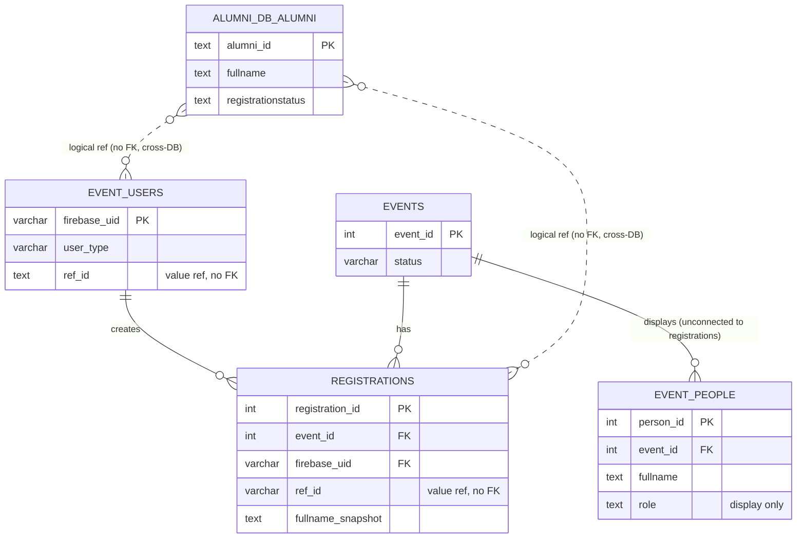

### B. Future person identity model

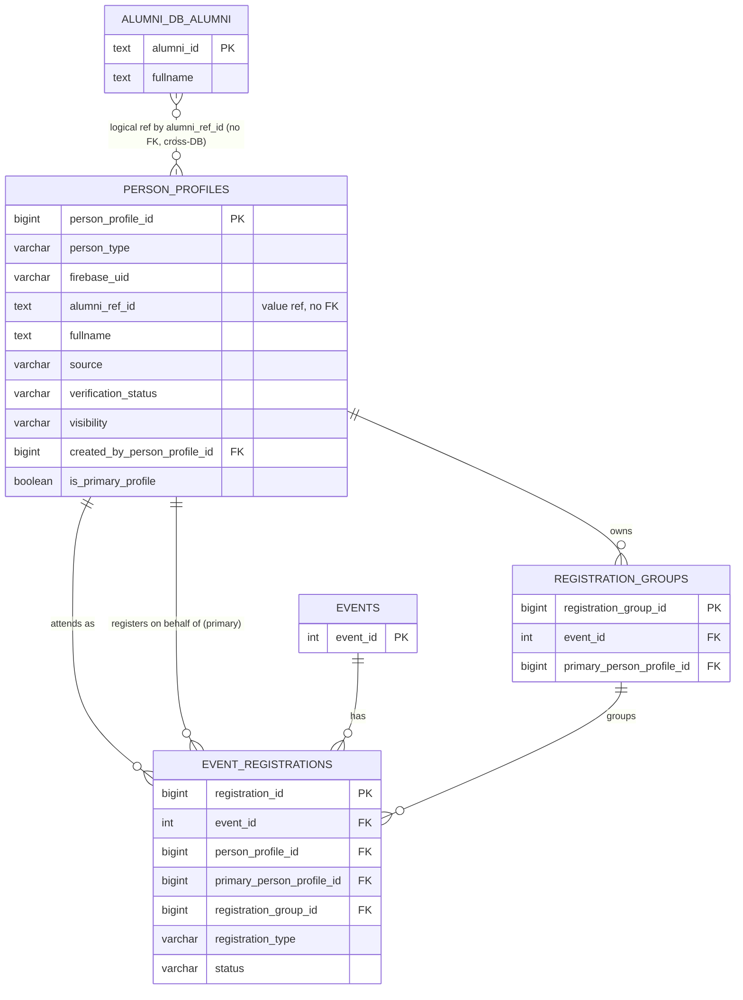

### C. Relationship self-join model

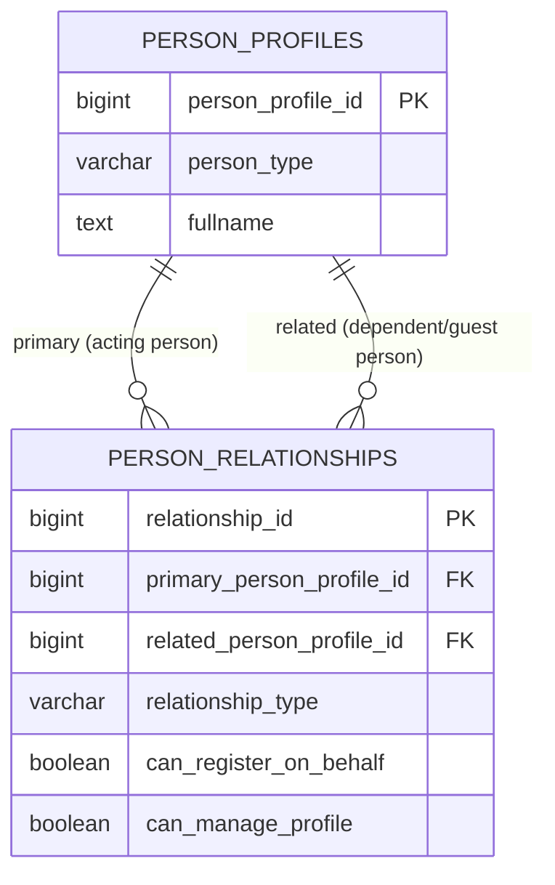

### D. Registration group model

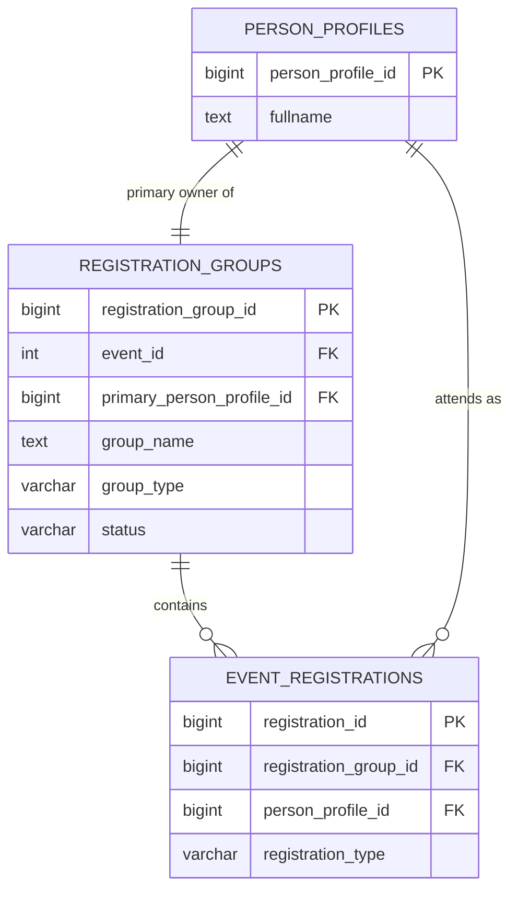

### E. Check-in future model (design target, not yet built — see §12)

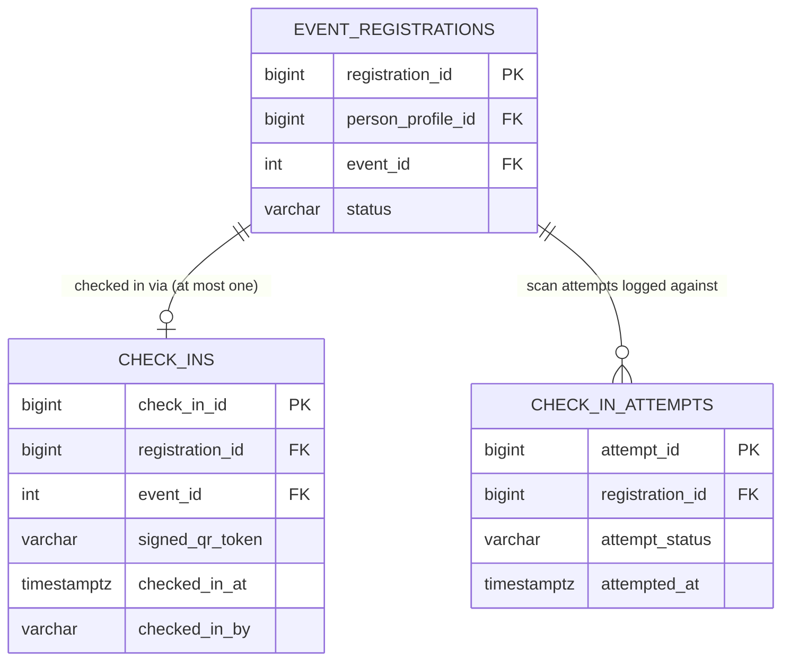

---

## 7. Domain Architecture Diagram

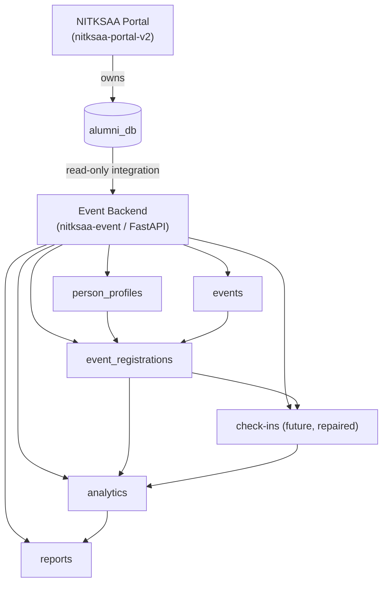

---

## 8. Identity Lifecycle Diagram

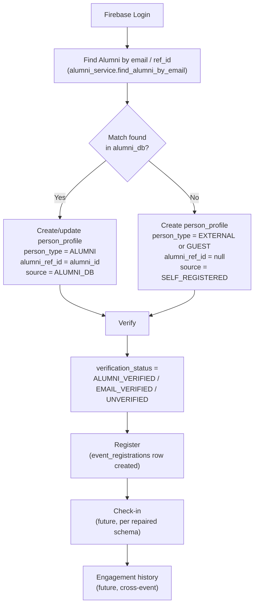

---

## 9. Registration Flow Diagrams

### A. Alumni registers self

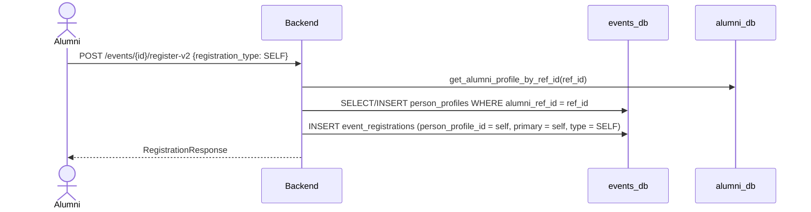

### B. Alumni registers spouse/family

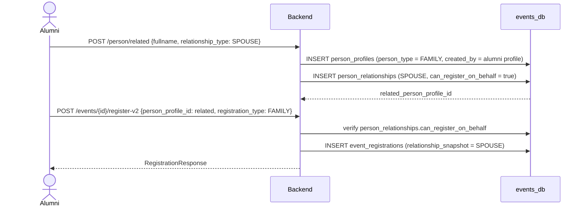

### C. Alumni registers a friend

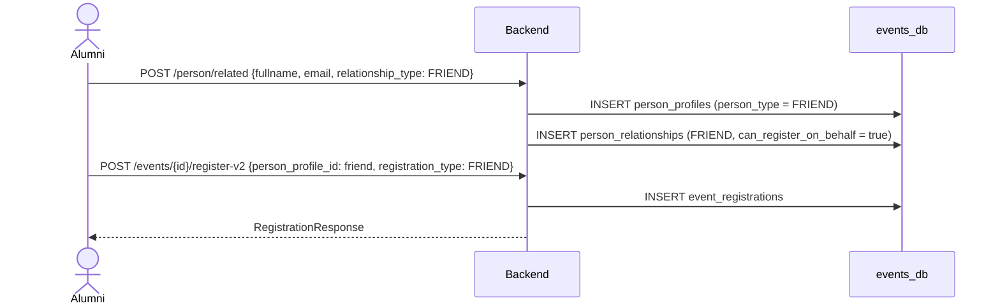

### D. External non-alumni registers self

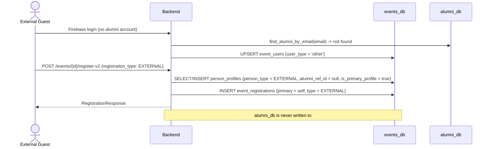

### E. Admin adds speaker

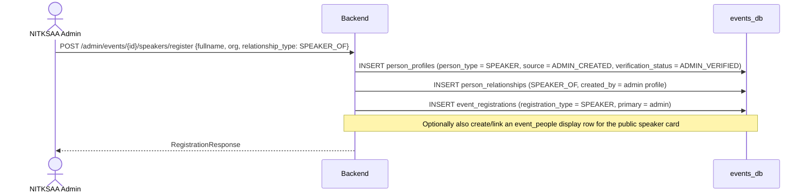

### F. Sponsor representative registration

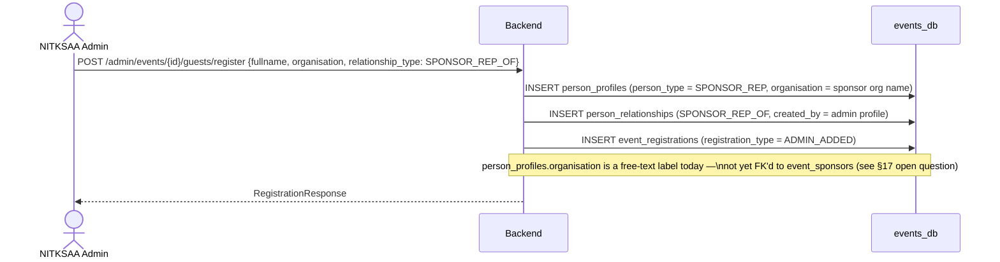

---

## 10. Migration Strategy

**Phase 0.** Do nothing before the July 10 demo. Current alumni-only flow into `registrations` stays
exactly as-is.

**Phase 1.** Clean migration track confusion (full detail in
[`schema_track_cleanup_report.md`](schema_track_cleanup_report.md)). Mark the Alpha schema file
deprecated/archived. Confirm — against an actual running database, not just code inspection — that
the live schema is the Week 1–5 track.

**Phase 2.** Create `person_profiles` as a purely additive table. Backfill one row per distinct
`ref_id`/`firebase_uid` pair from `event_users` and historical `registrations`, with
`person_type = ALUMNI`, `alumni_ref_id = ref_id`, `is_primary_profile = true`, `source = ALUMNI_DB`.
No existing table is altered.

**Phase 3.** Create `person_relationships`. Create a `SELF` relationship row for every backfilled
alumni person-profile (`primary = related = self`) so downstream "who registered whom" queries can
stay uniform from day one.

**Phase 4.** Create `event_registrations` (v2) **or** add `person_profile_id` to the current
`registrations` table. **Recommendation: create a new table.** Reasoning:
- The current `registrations` table is read by admin attendee export, analytics, and audit code that
  is working and demo-critical; adding new nullable columns to it is lower-risk than the alternative
  reasons below, but a parallel table avoids *any* risk of an `ALTER TABLE` interacting badly with the
  still-unresolved migration-track ambiguity (§ schema cleanup report).
- A new table lets `registration_type`, `status` enum, and snapshot columns be designed cleanly
  (e.g. adding `checked_in`/`no_show` to `status`) without a data-migration step on the live table.
- The old `registrations` table can be read-only "frozen" as the historical record for pre-cutover
  registrations, while new registrations flow into `event_registrations`. A read-side view/union can
  reconcile them for reporting once both exist.

**Phase 5.** Add family/friend/guest registration APIs (§13) on top of Phases 2–4.

**Phase 6.** Fix the check-in service against whichever registration model is selected (§12) — do
not attempt this before Phase 4 lands, since check-in must attach to a `registration_id` that is
stable.

**Phase 7.** Enable payments/refunds later — no schema exists yet; fully deferred.

---

## 11. Migration Track Cleanup Plan

See [`schema_track_cleanup_report.md`](schema_track_cleanup_report.md) for the complete file-by-file
analysis. Summary recommendation: archive `001_create_events_alpha_schema.sql` out of the active
migrations directory (e.g. into `backend/migrations/events_db/archive/` or a clearly-named
`0_DEPRECATED_...` prefix), correct `backend/README.md`'s setup instructions to reference only the
Week 1–5 sequence, and either rewrite or explicitly deprecate the `checkin_service.py` /
`checkin_repository.py` / `event_repository.py` (singular) code that depends on the Alpha shape.

---

## 12. Check-in Architecture Repair Plan

**Current broken methods.** `checkin_service.py` calls
`RegistrationRepository.get_by_token()`, `.get_attendee_by_registration()`, and
`.set_registration_status()` — none of which exist on the live
`backend/app/repositories/registration_repository.py`. Any call into `CheckInService.verify_qr()` or
`.check_in()` would raise `AttributeError` at runtime today, even though the router
(`admin_events.py`) mounts these endpoints successfully at import time (the failure is only visible
when the endpoint is actually invoked).

**Missing repository methods (relative to what checkin_service.py expects):**
- A way to look up a registration by its QR/verification token.
- A way to fetch "the attendee" for a registration (this assumes a separate `attendees` entity, which
  does not exist in the live schema — the live model has no `attendees` table at all).
- A way to transition a registration's `status` directly (today's `RegistrationRepository` only has
  narrow, purpose-built updates: `set_registration_number`, `update_email_status` — no generic status
  setter).

**Old schema dependency.** `checkin_repository.py`'s `create_checkin()` inserts into `check_ins` with
columns (`attendee_id`, `qr_token`, `checked_in_by`, `method`) that match only
`001_create_events_alpha_schema.sql`'s `check_ins` definition, not migration `004`'s
(`checkin_id`, `scanned_by`, `scanned_at`, `result`).

**Target check-in schema (recommended, pending Phase 4 decision on §10):**
- Check-in attaches to **`registration_id`** as the primary key relationship (one check-in per
  registration, enforced by a unique constraint), with `event_id` denormalized onto the check-in row
  for query convenience — mirroring the diagram in §6E.
- Check-in should reference `person_profile_id` transitively through the registration, not directly —
  avoids a redundant FK and keeps "who checked in" always traceable to "which registration let them
  in," which matters for capacity/audit correctness.
- QR token: a signed, opaque token (HMAC-SHA256 over `registration_id` + a server secret, as already
  flagged as deferred in `backend/README.md`: *"Production QR token hashing (HMAC-SHA256)"*) — not a
  bare integer or predictable string. No PII (name, email, phone) should ever be encoded in the QR
  payload itself; it should resolve to a registration only via server-side lookup.
- Recommended token structure: `nitksaa_evt_<random-256-bit>` (matching the prefix already mentioned
  in `backend/README.md`'s "What Was Built" section), stored hashed server-side, compared via
  constant-time comparison.

**Security rules:**
- Signed token — server-verifiable, not just server-generated.
- No PII in the QR payload.
- Expiry is optional (event-scoped tokens likely don't need per-scan expiry, but consider expiring
  shortly after event `end_datetime`).
- Duplicate check-in must be guarded by a DB-level unique constraint (`registration_id`), not just an
  application-level check, to survive concurrent scans.
- Every scan attempt (success, duplicate, invalid, unauthorized) must be audit-logged — this pattern
  already exists correctly in the Alpha `check_in_attempts` table design; it should be preserved in
  whatever schema is finalized.

---

## 13. Backend API Plan

| API | Purpose | Auth | Request | Response | Security notes |
|---|---|---|---|---|---|
| `GET /api/v1/person/me` | Return the caller's own person profile | Bearer JWT | — | `person_profile_id, person_type, fullname, email, verification_status, ...` | Only returns the caller's own row |
| `POST /api/v1/person/related` | Create a related person (family/friend) | Bearer JWT | `{fullname, email?, phone?, relationship_type}` | Created `person_profile_id` + `relationship_id` | Only alumni (or roles explicitly allowed) may create related profiles; rate-limit to curb spam |
| `GET /api/v1/person/related` | List people the caller can register on behalf of | Bearer JWT | — | List of related `person_profiles` + relationship rows | Never expose to any user other than the primary |
| `PUT /api/v1/person/related/{id}` | Edit a related person's details | Bearer JWT | Partial fields | Updated profile | Only if `can_manage_profile = true` for the caller's relationship to that person |
| `DELETE /api/v1/person/related/{id}` | Remove a relationship (soft-delete recommended) | Bearer JWT | — | 204 | Must not cascade-delete past registrations |
| `POST /api/v1/events/{event_id}/register-v2` | Register self or a related person | Bearer JWT | `{person_profile_id?, registration_type, attendee_note?}` | `RegistrationResponse` | Same capacity/eligibility checks as today, generalized to any `person_profile_id` the caller is authorized for |
| `GET /api/v1/events/{event_id}/my-registrations-v2` | List all registrations the caller made (self + on behalf of others) for one event | Bearer JWT | — | List of `RegistrationResponse` | |
| `GET /api/v1/my/registrations-v2` | List all registrations the caller made across all events | Bearer JWT | — | List of `RegistrationResponse` | |
| `POST /api/v1/admin/events/{event_id}/speakers/register` | Admin creates a speaker person + registers them | Admin JWT | `{fullname, organisation?, bio?, relationship_type: SPEAKER_OF}` | `RegistrationResponse` | Admin-only; optionally links an `event_people` display row |
| `POST /api/v1/admin/events/{event_id}/guests/register` | Admin creates a guest/sponsor-rep/VIP person + registers them | Admin JWT | `{fullname, organisation?, person_type, relationship_type}` | `RegistrationResponse` | Admin-only |
| `POST /api/v1/admin/events/{event_id}/check-ins/verify` | Verify a QR token before check-in (no state change) | Admin/scanner JWT | `{qr_token}` | `{valid, registration_id, fullname, already_checked_in}` | Never returns raw PII beyond what the scanner role needs |
| `POST /api/v1/admin/events/{event_id}/check-ins` | Perform the check-in | Admin/scanner JWT | `{qr_token, notes?}` | Check-in record | Enforce unique-constraint-backed duplicate guard; audit every attempt |

---

## 14. Frontend Impact

Documented for planning only — **no UI is implemented as part of this task.**

- Add a family/friend registration form (create related `person_profiles` + relationship, then
  register).
- Add a guest registration flow for admins.
- Add a speaker invite flow (admin-side, likely tied into the existing `event_people` display
  management screen).
- Add a "group pass" view — one booking, multiple registrations, one `registration_group_id`.
- Add support for viewing multiple event passes per person (since one person can now hold several
  registrations across events, and one alumni account can hold registrations for several related
  people).
- Add a "manage my people" / relation manager screen (list, add, edit, remove related profiles).
- Add profile visibility settings (`PRIVATE` / `EVENT_VISIBLE` / `PUBLIC_PROFILE`) if speaker/guest
  public profiles are exposed.
- Add admin-created guest profile support (search-or-create UI when admin registers a speaker/guest
  who has no login).

---

## 15. Security and Privacy

- **PII minimization:** collect only what each `person_type` genuinely needs (a speaker's bio/photo
  is public-facing by design; a family member's phone number may not be needed at all).
- **Relationship privacy:** `person_relationships` rows are visible only to the `primary` party and
  admins — never exposed in any public or cross-user API response.
- **Public attendee list rules:** unchanged from today's `show_attendee_list` behavior — admins always
  see full attendee data regardless of the flag; the flag gates public visibility only.
- **Speaker public profile rules:** `event_people` display data (bio, photo, org) is intentionally
  public; it must stay decoupled from any registration/contact PII (email, phone) that a linked
  `person_profiles` row might also hold.
- **Guest limited access:** non-alumni `person_type`s should default to the minimum viable
  `verification_status` and `visibility` needed to attend — no assumption of portal-equivalent access.
- **Alumni identity verification:** unchanged — `alumni_service.is_alumni_active` gate stays the
  authority for whether an `ALUMNI`-type person is eligible to self-register.
- **Non-alumni verification:** email/phone verification should gate `SELF_REGISTERED` externals
  before they can register, to reduce spam/abuse (open question, §17).
- **Audit logs:** every person-profile creation, relationship creation, and registration should emit
  an `event_audit_log` row, consistent with the existing `audit_service.emit()` pattern — never
  writing PII into `context` (existing rule, migration 009 comment).
- **QR token security:** see §12 — signed, opaque, no embedded PII.
- **No cross-DB FK:** unchanged, structurally impossible and not attempted.
- **No writes to `alumni_db`:** unchanged, hard rule carried forward into every new table design.

---

## 16. Data Examples

### Alumni self registration

| person_profile_id | person_type | alumni_ref_id | fullname | is_primary_profile |
|---|---|---|---|---|
| 201 | ALUMNI | NITK2026IT001 | Sudarshana Karkala | true |

| registration_id | person_profile_id | primary_person_profile_id | registration_type |
|---|---|---|---|
| 9001 | 201 | 201 | SELF |

### Alumni spouse registration

| person_profile_id | person_type | alumni_ref_id | fullname | created_by_person_profile_id |
|---|---|---|---|---|
| 202 | FAMILY | null | Anjali Karkala | 201 |

| relationship_id | primary_person_profile_id | related_person_profile_id | relationship_type | can_register_on_behalf |
|---|---|---|---|---|
| 5001 | 201 | 202 | SPOUSE | true |

| registration_id | person_profile_id | primary_person_profile_id | registration_type |
|---|---|---|---|
| 9002 | 202 | 201 | FAMILY |

### Alumni friend registration

| person_profile_id | person_type | alumni_ref_id | fullname | created_by_person_profile_id |
|---|---|---|---|---|
| 203 | FRIEND | null | Rakesh Shetty | 201 |

| registration_id | person_profile_id | primary_person_profile_id | registration_type |
|---|---|---|---|
| 9003 | 203 | 201 | FRIEND |

### External guest registration

| person_profile_id | person_type | alumni_ref_id | fullname | is_primary_profile |
|---|---|---|---|---|
| 204 | EXTERNAL | null | Priya Nair | true |

| registration_id | person_profile_id | primary_person_profile_id | registration_type |
|---|---|---|---|
| 9004 | 204 | 204 | EXTERNAL |

### Admin speaker registration

| person_profile_id | person_type | alumni_ref_id | fullname | organisation | created_by_person_profile_id |
|---|---|---|---|---|---|
| 205 | SPEAKER | null | Dr. Vikram Rao | Independent | (admin profile id) |

| registration_id | person_profile_id | primary_person_profile_id | registration_type |
|---|---|---|---|
| 9005 | 205 | (admin profile id) | SPEAKER |

### Sponsor representative registration

| person_profile_id | person_type | alumni_ref_id | fullname | organisation | created_by_person_profile_id |
|---|---|---|---|---|---|
| 206 | SPONSOR_REP | null | Meera Kulkarni | Acme Motors | (admin profile id) |

| registration_id | person_profile_id | primary_person_profile_id | registration_type |
|---|---|---|---|
| 9006 | 206 | (admin profile id) | ADMIN_ADDED |

### Family group registration

| registration_group_id | event_id | primary_person_profile_id | group_name | group_type |
|---|---|---|---|---|
| 701 | 12 | 201 | Sudarshana Karkala + family | FAMILY |

| registration_id | person_profile_id | registration_group_id | registration_type |
|---|---|---|---|
| 9001 | 201 | 701 | SELF |
| 9002 | 202 | 701 | FAMILY |

---

## 17. Risks and Open Questions

- **Schema track confusion** — must be resolved (§11, cleanup report) before Phase 2 begins; building
  `person_profiles` on top of an uncertain live schema compounds the ambiguity.
- **Check-in broken state** — confirmed broken at the code level (§12); must not be extended, only
  repaired.
- **Migration sequencing** — Phases 2–4 are additive and low-risk individually, but Phase 4's
  new-table-vs-alter-table decision has real consequences for reporting continuity; needs sign-off,
  not just this document's recommendation.
- **Duplicate person detection** — no design yet for merging/deduplicating `person_profiles` (e.g. the
  same friend added by two different alumni, or a person who later becomes an alumnus). Open.
- **Email uniqueness** — unlike `alumni.email` (`UNIQUE`), `person_profiles.email` has no proposed
  uniqueness constraint; needs a decision (globally unique? unique per `person_type`? not unique at
  all, since one family member could plausibly share a household email?).
- **Family member PII consent** — registering a child or spouse captures their PII without their own
  consent flow; needs a policy decision, especially for `EMAIL_VERIFIED` status when the "family
  member" is a minor.
- **Child attendee data** — closely related to consent; no age field or minor-handling policy exists
  in the proposed schema.
- **Guest/spam abuse** — an alumni (or compromised account) could mass-create fake `FRIEND`/`GUEST`
  profiles; needs a rate limit or admin review step, not yet designed.
- **Data retention** — no retention/deletion policy proposed for `person_profiles` of people who never
  return (e.g. a one-time external guest from 2024).
- **Cancellation/refund behavior** — deferred along with payments (§10 Phase 7); the `status` enum
  includes `cancelled`/`no_show` but no refund workflow is designed.
- **Analytics impact** — existing `analytics_service.log_event_activity` calls are keyed on
  `firebase_uid`; family/friend/guest registrations created by an admin or on someone's behalf may not
  have a `firebase_uid` at all, so analytics event shapes will need to accept `person_profile_id` as an
  alternative key. Not yet designed.
- **Multi-tenancy (requirement #15)** — no `tenant_id` concept exists anywhere in the current schema.
  Reusing this platform for EV.ENGINEER/EV Society is a substantial, separate architectural question
  (single schema with tenant scoping vs. separate deployments) that this document deliberately does
  not attempt to answer — flagging it as a major open question rather than guessing.
- **`event_people` (speaker display cards) vs `person_profiles` (identity)** — open question on
  whether `event_people` should be merged into `person_profiles`/`event_registrations`, kept as a
  display-only layer that optionally *links* to a `person_profiles` row, or left entirely separate.
  This document does not decide it (§18).
- **`event_sponsors`/`event_partners` (org display) vs `SPONSOR_REP`/`EXHIBITOR` person type** — no
  proposed FK between a sponsor-rep person and the sponsoring organization's display row; today
  `organisation` on `person_profiles` is free text only. Open question for next week.

---

## 18. Final Recommendation

**For next week:**
- Do **not** implement family/friend registration immediately.
- First clean the schema tracks (Phase 1 / cleanup report) — confirm which migration track is live
  against a real database, not just inferred from code.
- Then introduce `person_profiles` as a purely additive table (Phase 2).
- Then backfill it from `event_users` + `registrations` (Phase 2, continued).
- Then add `person_relationships` with `SELF` rows for all backfilled alumni (Phase 3).
- Then produce the `event_registrations` (v2) design decision as a reviewed proposal, not a build —
  get sign-off on the new-table-vs-alter-table question (§10 Phase 4) before writing any migration.
- Then repair check-in (Phase 6) against whichever registration model is chosen — this is
  deliberately last, since it's the most broken piece and the least reversible if built on shifting
  ground.
