# NITKSAA Event Platform — Architecture Diagrams v1

**Version:** 1.0  
**Date:** 2026-06-19  
**Scope:** Week 1 → Week 3  
**Syntax:** Mermaid (render at mermaid.live or in any Mermaid-compatible viewer)  
**Source document:** `docs/architecture/nitksaa_complete_architecture_v1.md`

---

## Diagram Index

| ID | Title | Section |
|---|---|---|
| D1 | System Overview | A |
| D2 | Authentication Flow — Full Sequence | B |
| D3 | Authentication — Identity Relationships | B |
| D4 | Events DB — Entity Relationship | C |
| D5 | Alumni DB — Usage Diagram | D |
| D6 | Registration Flow — Sequence Diagram | E |
| D7 | Registration Flow — State Machine | E |
| D8 | Join Link Security Rules | F |
| D9 | Email Flow — Sequence Diagram | G |
| D10 | Audit Log — Event Flow | H |
| D11 | Developer Diagnostics — Hierarchy | I |
| D12 | Flutter App — Layer Architecture | J |
| D13 | Admin Portal — Layer Architecture | K |
| D14 | API Request Flow — End-to-End | L |
| D15 | Migration Timeline | M |
| D16 | Week 4 Dependency Graph | P |

---

## D1 — System Overview

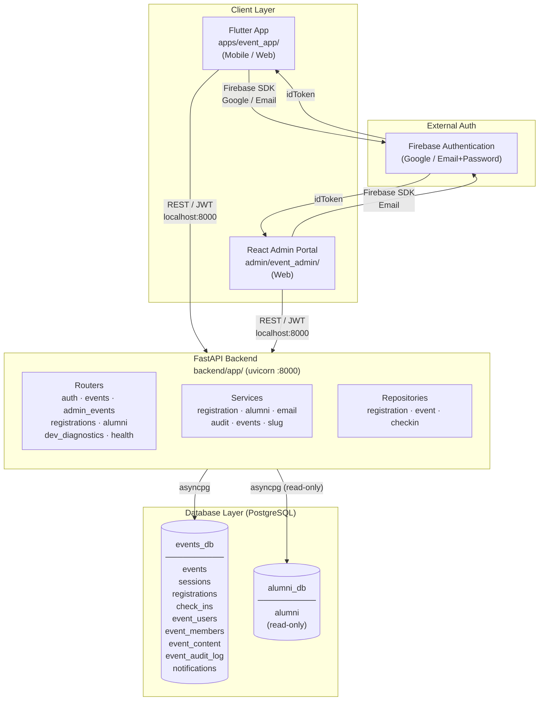

---

## D2 — Authentication Flow (Full Sequence)

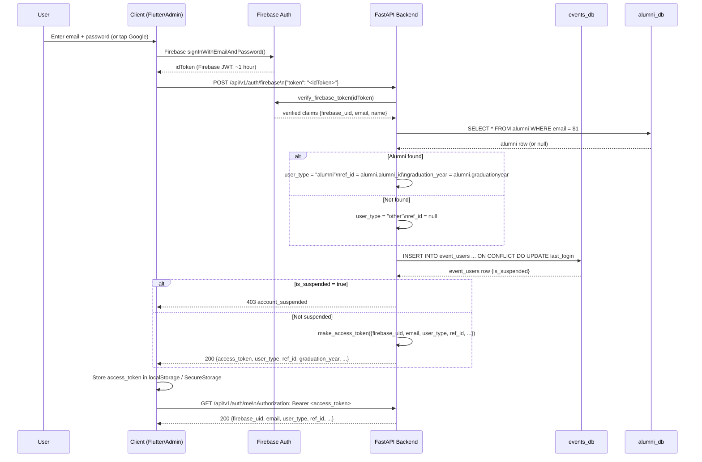

---

## D3 — Authentication — Identity Relationships

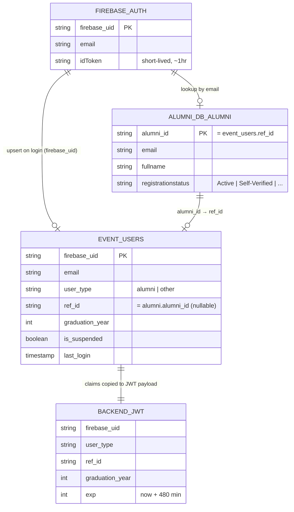

---

## D4 — Events DB Entity Relationship Diagram

```mermaid
erDiagram
    EVENTS {
        int event_id PK
        text slug UK
        text title
        varchar status "draft|published|cancelled|completed"
        boolean is_virtual
        text virtual_url "NEVER in public API"
        int capacity "NULL = unlimited"
        timestamptz registration_opens_at
        timestamptz registration_closes_at
        boolean show_attendee_list
        varchar created_by_firebase_uid FK
    }

    SESSIONS {
        int session_id PK
        int event_id FK
        text title
        text speaker_name
        int sort_order
    }

    EVENT_USERS {
        varchar firebase_uid PK
        text email
        varchar user_type "alumni|other"
        text ref_id "alumni_id"
        boolean is_suspended
    }

    EVENT_MEMBERS {
        int event_id PK-FK
        varchar firebase_uid PK-FK
        varchar role
        varchar status "active"
    }

    REGISTRATIONS {
        int registration_id PK
        int event_id FK
        varchar firebase_uid FK
        text ref_id "alumni_id"
        varchar status "registered|cancelled"
        text registration_number "NITKSAA-YYYY-NNNNNN"
        text fullname_snapshot
        text email "email_snapshot"
        text phone "phone_snapshot"
        int batch_year_snapshot
        text branch_snapshot
        varchar confirmation_email_status "pending|sent|failed|skipped"
        text notes "= attendee_note in API"
    }

    CHECK_INS {
        int checkin_id PK
        int registration_id FK
        int event_id FK
        varchar scanned_by FK
        varchar result "success|duplicate|invalid"
    }

    EVENT_CONTENT {
        int content_id PK
        int event_id FK
        varchar content_type "recording|gallery"
        text url
    }

    EVENT_AUDIT_LOG {
        bigint log_id PK
        varchar actor_uid
        text event_type
        text entity_type
        int entity_id
        jsonb context "NO PII in context"
    }

    NOTIFICATIONS {
        bigint notification_id PK
        varchar firebase_uid
        text event_type
        boolean is_read
    }

    EVENTS ||--o{ SESSIONS : "has sessions"
    EVENTS ||--o{ EVENT_MEMBERS : "has members"
    EVENTS ||--o{ REGISTRATIONS : "has registrations"
    EVENTS ||--o{ CHECK_INS : "has check-ins"
    EVENTS ||--o{ EVENT_CONTENT : "has content"
    EVENTS }o--|| EVENT_USERS : "created_by"
    EVENT_USERS ||--o{ EVENT_MEMBERS : "is member of"
    EVENT_USERS ||--o{ REGISTRATIONS : "registers"
    EVENT_USERS ||--o{ CHECK_INS : "scans"
    REGISTRATIONS ||--o{ CHECK_INS : "generates"
```

---

## D5 — Alumni DB Usage

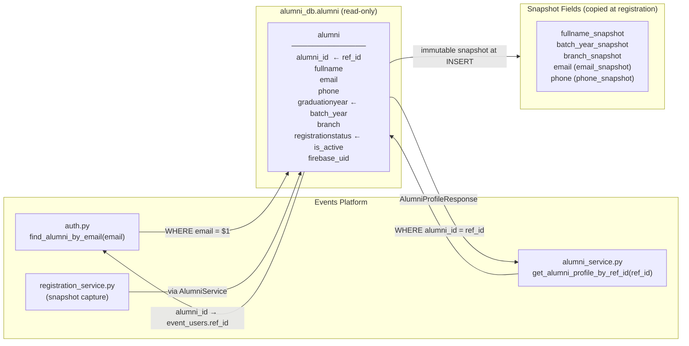

---

## D6 — Registration Flow — Full Sequence

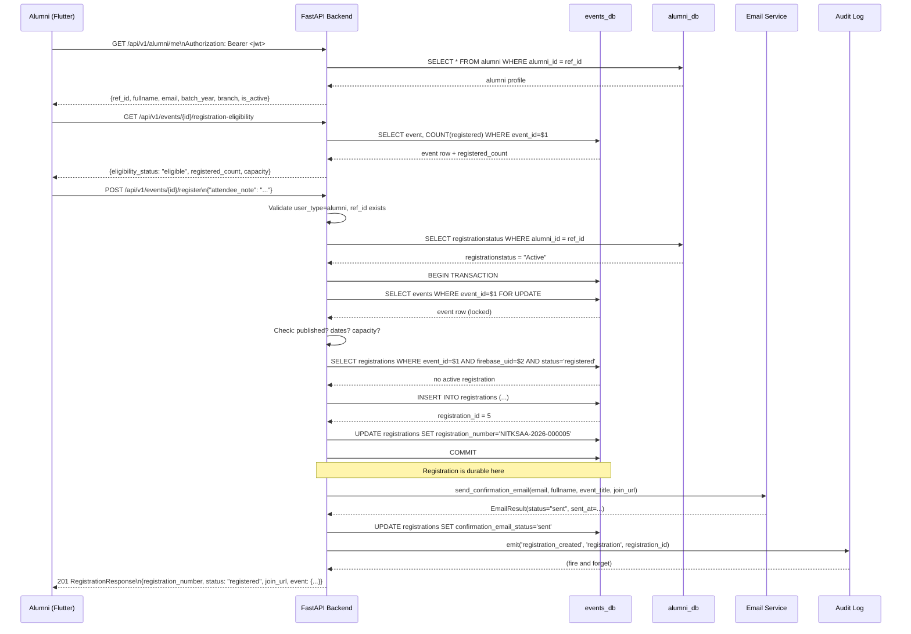

---

## D7 — Registration State Machine

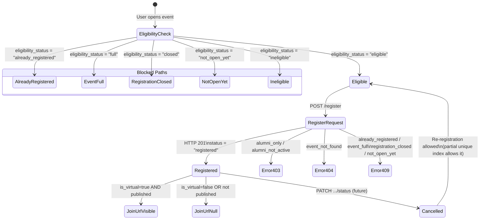

---

## D8 — Join Link Security Rules

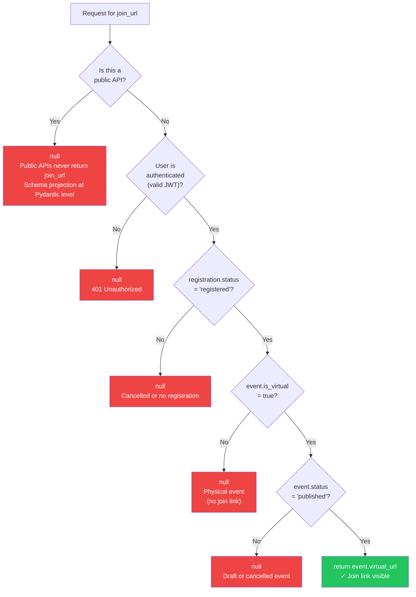

---

## D9 — Email Flow — Sequence Diagram

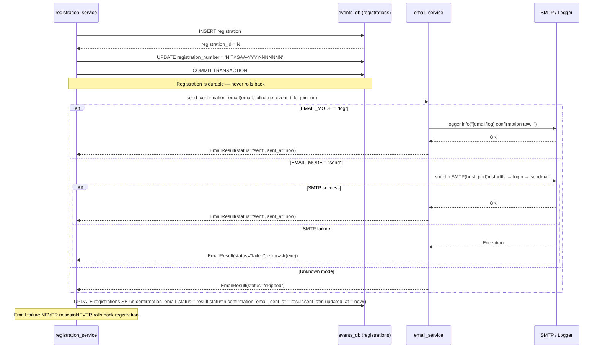

---

## D10 — Audit Log — Event Flow

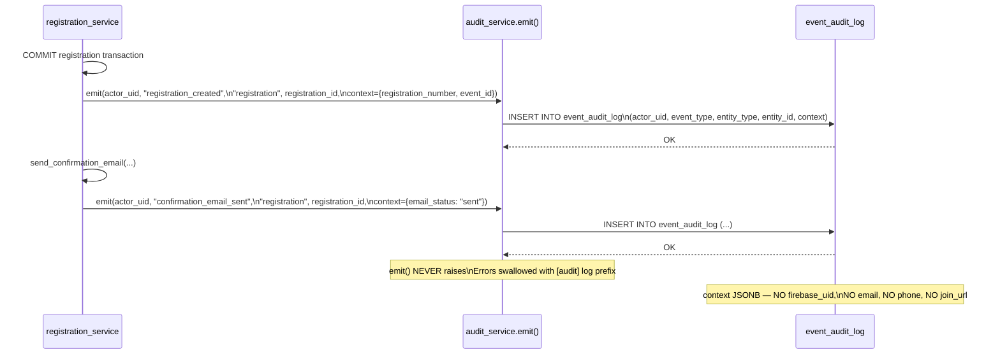

---

## D11 — Developer Diagnostics — Hierarchy

```mermaid
graph TD
    DD["Developer Diagnostics Screen\n(kDebugMode only)"]

    DD --> GEN["General"]
    DD --> AUTH["Authentication"]
    DD --> DBCat["Database"]
    DD --> EVENTS["Event Management"]
    DD --> REG["Registration"]
    DD --> ADMIN["Admin / Attendees"]
    DD --> ALUMNICAT["Alumni Database"]

    GEN --> G1["Foundation Status\nFirebase, Hive, Router"]
    GEN --> G2["Logger Test\nEmit test logs"]
    GEN --> G3["Theme Control\nLight / Dark / System"]
    GEN --> G4["Network Test\nGET /health"]
    GEN --> G5["App Performance\nNotes"]
    GEN --> G6["Debug Tools\nExport report, Clear cache"]

    AUTH --> A1["Firebase Token Test\nCapture idToken preview"]
    AUTH --> A2["Backend Auth Test\nPOST /auth/firebase"]
    AUTH --> A3["/auth/me Test\nGET /auth/me"]

    DBCat --> D1["Event Users Test\nInspect event_users table"]
    DBCat --> D2["Database Tables Test\nList tables + row counts"]

    EVENTS --> E1["Events API Test ⏳"]
    EVENTS --> E2["Event Detail API Test ⏳"]
    EVENTS --> E3["Event Creation API Test ⏳"]
    EVENTS --> E4["Event Publish Test ⏳"]

    REG --> W3["Week 3 UX Showcase\n16 sections (§0–§12)"]
    REG --> R1["Registration Flow Test\n13-check backend suite"]
    REG --> R2["My Registration Test"]
    REG --> R3["Capacity Guard Test"]
    REG --> R4["Confirmation Email Status"]
    REG --> R5["Join Link Visibility Test"]

    ADMIN --> ADM1["Attendee List API Test ⏳"]
    ADMIN --> ADM2["Attendee Export Test ⏳"]
    ADMIN --> ADM3["Admin Role Guard Test ⏳"]
    ADMIN --> ADM4["Audit Trail Test ⏳"]

    ALUMNICAT --> AL1["Search by Email\nGET /alumni/search?email="]
    ALUMNICAT --> AL2["Search by Prefix\nGET /alumni/search-prefix?prefix="]
    ALUMNICAT --> AL3["Lookup by Alumni ID\nGET /alumni/{alumni_id}"]
    ALUMNICAT --> AL4["Login Mapping Trace\nGET /alumni/login-trace?email="]

    AL4 --> DIAG1["alumni_db lookup"]
    AL4 --> DIAG2["event_users lookup"]
    AL4 --> DIAG3["PASS / FAIL diagnosis"]

    W3 --> S0["§0 Run All (13 checks)"]
    W3 --> S1["§1 Alumni Autofill"]
    W3 --> S2["§2 Eligibility"]
    W3 --> S3["§3 Registration Action"]
    W3 --> S4["§4 Confirmation Preview"]
    W3 --> S5["§5 My Registration"]
    W3 --> S6["§6 My Registrations List"]
    W3 --> S7["§7 Negative Gallery"]
    W3 --> S8a["§8a Join Link Matrix"]
    W3 --> S8b["§8b Public Leak Check"]
    W3 --> S9["§9 Audit Trail"]
    W3 --> S10["§10 Email Demo"]
    W3 --> S11["§11 Snapshot Demo"]
    W3 --> S12["§12 DB Rules"]
```

---

## D12 — Flutter App — Layer Architecture

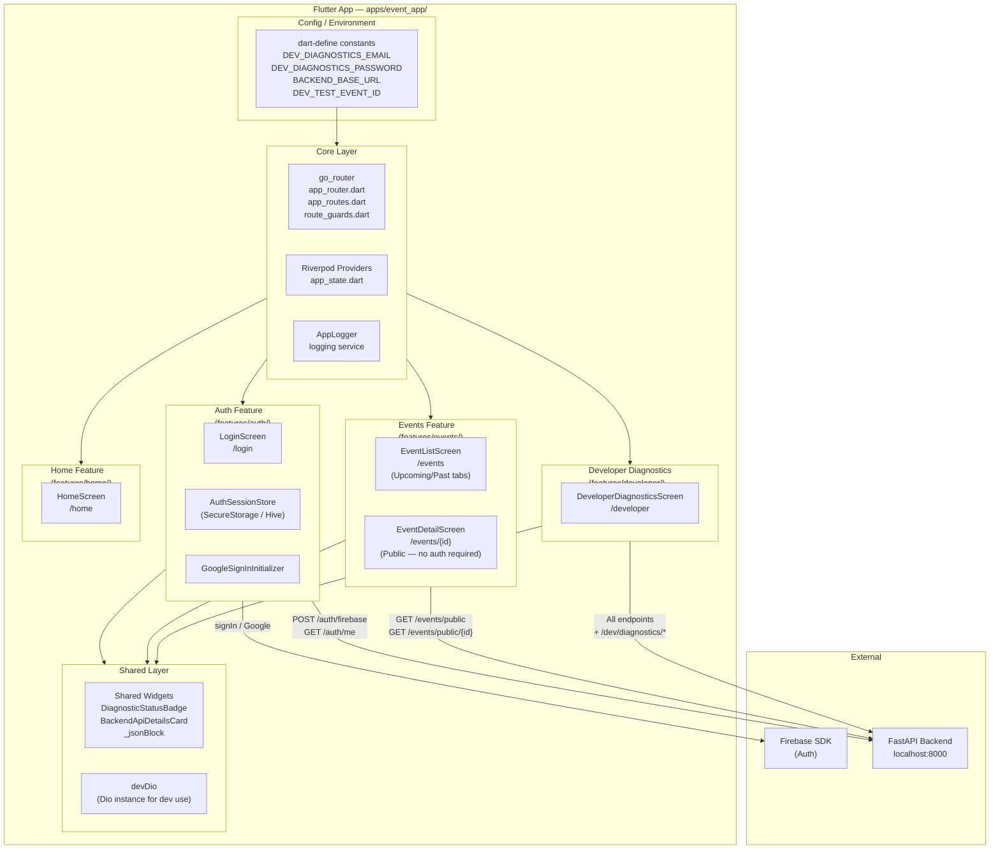

---

## D13 — Admin Portal — Layer Architecture

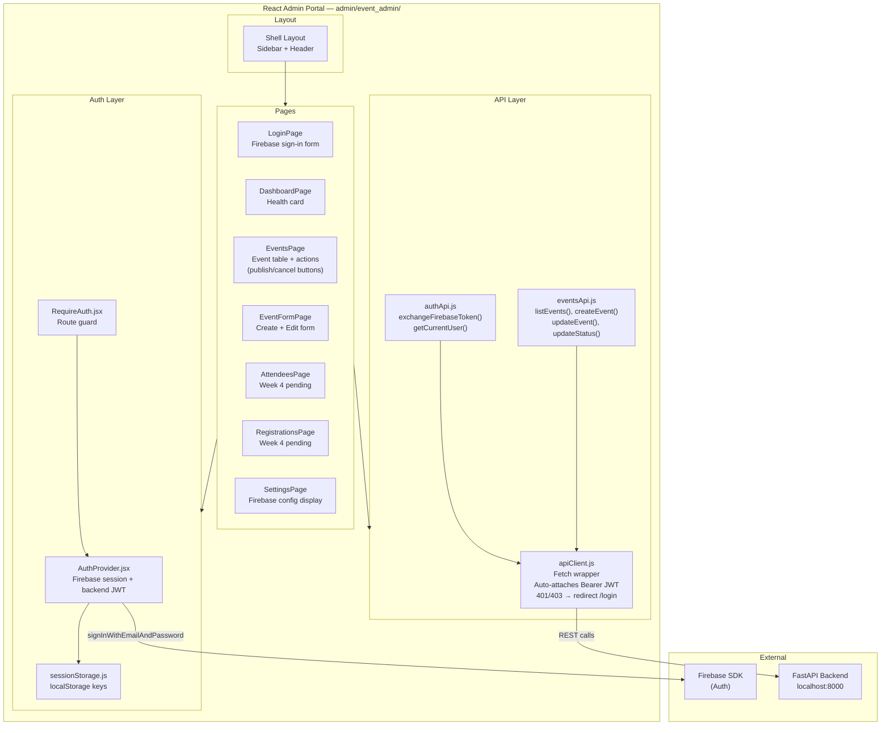

---

## D14 — API Request Flow — End-to-End

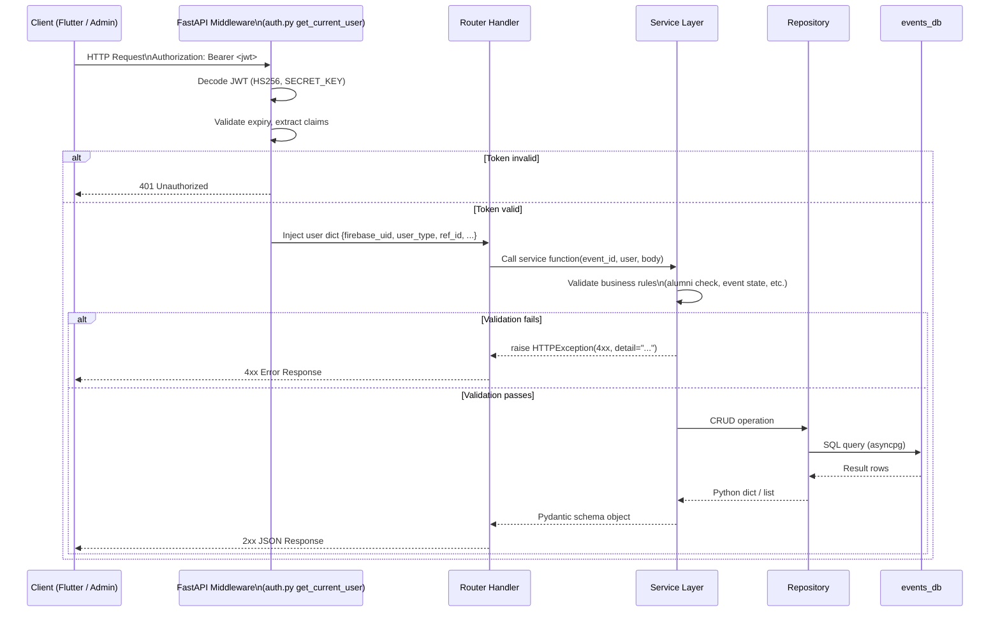

---

## D15 — Migration Timeline

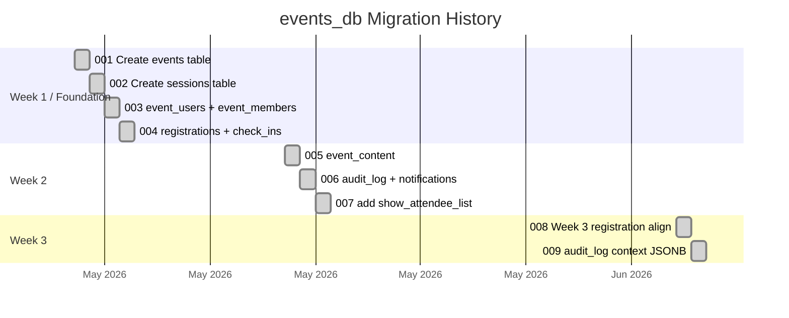

---

## D16 — Week 4 Dependency Graph

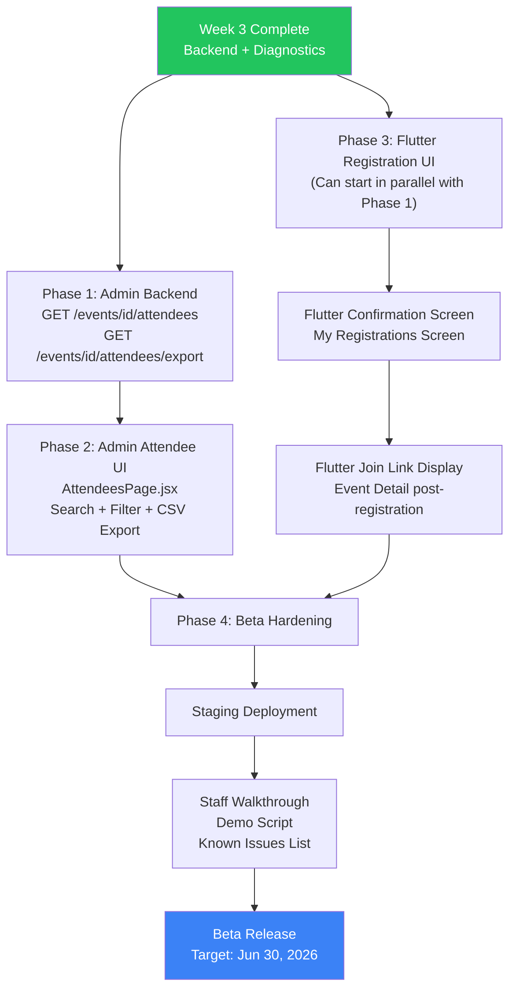

---

*All textual descriptions for these diagrams are in: `docs/architecture/nitksaa_complete_architecture_v1.md`*
