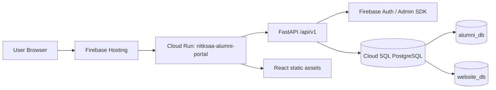
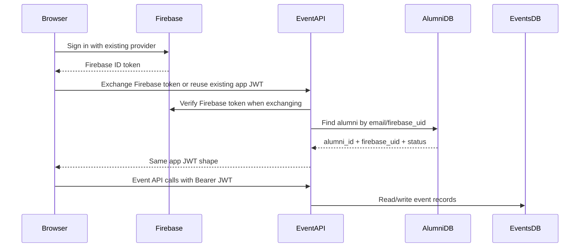

# Existing System Architecture Review for the NITKSAA Event Ecosystem

This document reviews the existing NITKSAA Alumni Portal and its connected website-facing architecture so the new Event App and Event Admin system can reuse the same identity, infrastructure, backend conventions, frontend patterns, database posture, and deployment model.

No implementation is proposed here as executable code. This is a reference document for future Event App implementation work.

## 1. Existing Infrastructure Overview

### Current System Shape

The implemented repository is a full-stack NITKSAA Alumni Portal:

- Backend: FastAPI, Python 3.11, Pydantic, raw SQL through `psycopg2`.
- Frontend: React 18, Vite, React Router.
- Authentication: Firebase Authentication for alumni and email/password plus TOTP for admins.
- Database: PostgreSQL on Google Cloud SQL.
- Deployment: Dockerized single deployable unit on Cloud Run.
- Hosting: Firebase Hosting rewrites all traffic to the Cloud Run service.

The production model is intentionally simple: the Docker build compiles the React frontend and copies the static assets into the FastAPI container. FastAPI serves `/api/*` as API routes and serves the SPA for non-API paths.



### Firebase Projects

The code uses the Firebase project ID:

- `project-d22bed42-f302-4e23-8dc`

The same project appears in both backend and frontend configuration:

- Backend default `FIREBASE_PROJECT_ID` in `webapp/backend/config.py`.
- Frontend `VITE_FIREBASE_PROJECT_ID` in `webapp/frontend/.env.production`.
- Firebase Admin SDK initialization uses Application Default Credentials and passes the same project ID.

Event App requirement:

- Reuse this same Firebase project.
- Reuse the same Firebase Authentication users.
- Reuse the same Firebase UID as the durable user identity.
- Do not create a separate Firebase app/project for event users.

### Cloud Run Services

Firebase Hosting rewrites to:

- Service: `nitksaa-alumni-portal`
- Region: `asia-south1`

The existing app exposes:

- `/healthz` for Cloud Run startup/liveness without DB dependency.
- `/api/v1/health` for app and DB health, currently also used for contact cleanup.
- `/api/docs`, `/api/redoc`, `/api/openapi.json` for FastAPI docs.

Event App recommendation:

- Prefer a separate Cloud Run service for the Event App backend/frontend only if the operational boundary requires it, but keep the same architecture style and authentication contract.
- If deployed separately, name and route it consistently, for example `nitksaa-events` behind Firebase Hosting rewrites or a subdomain.
- Keep `/healthz` as the lightweight probe and `/api/v1/health` as the DB-aware health endpoint.

### Cloud SQL Usage

The existing code uses one Cloud SQL instance:

- Instance connection name: `project-d22bed42-f302-4e23-8dc:asia-south1:nitksaa-alumni-db`
- Production access: Unix socket at `/cloudsql/project-d22bed42-f302-4e23-8dc:asia-south1:nitksaa-alumni-db`
- Local access: host/port from `.env`, commonly through Cloud SQL Proxy.

Current databases in use:

- `alumni_db`: primary portal data, alumni identity, admin users, audit log.
- `website_db`: contact requests and connections shared with the website.

Event App requirement:

- Reuse the same Cloud SQL instance.
- Add a new database/schema named `events_db`.
- Keep `alumni_db` unchanged as the source of alumni identity.
- Store `registrations.ref_id -> alumni_db.alumni_id` as a value reference only.
- Do not use cross-database foreign keys.

### Hosting Setup

Current Firebase Hosting setup rewrites all routes to Cloud Run:

```json
{
  "source": "**",
  "run": {
    "serviceId": "nitksaa-alumni-portal",
    "region": "asia-south1"
  }
}
```

Known production domain signal from code:

- `directory.nitkalumni.in` appears in feedback email copy.

Recommended Event App routing:

- Keep event domains under the same ecosystem, for example `events.nitkalumni.in` or `/events`.
- Use Firebase Hosting rewrites to Cloud Run if the Event App is its own service.
- Avoid a disconnected hosting stack unless there is a strong operational reason.

### Environment Configs

Backend configuration is centralized in `webapp/backend/config.py` using `pydantic-settings`.

Current backend environment keys:

- `DB_HOST`
- `DB_PORT`
- `DB_NAME`
- `DB_USER`
- `DB_PASSWORD`
- `DB_SSLMODE`
- `SECRET_KEY`
- `ACCESS_TOKEN_EXPIRE_MINUTES`
- `ADMIN_USERNAME`
- `ADMIN_PASSWORD`
- `APP_ENV`
- `ALLOWED_ORIGINS`
- `FIREBASE_PROJECT_ID`
- `GMAIL_APP_PASSWORD`

Frontend configuration uses Vite environment variables:

- `VITE_FIREBASE_API_KEY`
- `VITE_FIREBASE_AUTH_DOMAIN`
- `VITE_FIREBASE_PROJECT_ID`
- `VITE_FIREBASE_APP_ID`

Deployment ignores secrets:

- `.env` files are ignored.
- `webapp/frontend/.env.production` is intentionally included by `.gcloudignore`.
- Backend secrets are expected to come from environment variables or Secret Manager.

Event App guidance:

- Extend the existing `Settings` style rather than introducing a new config mechanism.
- Use `EVENTS_DB_NAME=events_db` or a dedicated events DB setting.
- Keep Firebase settings identical to the portal.
- Keep secrets in Secret Manager for production.

### Deployment Strategy

Current deployment pattern:

- Docker stage 1 builds React via `npm ci` and `npm run build`.
- Docker stage 2 installs Python dependencies and copies backend source.
- Built frontend is copied into backend `static/`.
- Cloud Run starts `uvicorn main:app --host 0.0.0.0 --port $PORT`.

Event App guidance:

- Reuse a multi-stage Docker build.
- Reuse Cloud Run.
- Keep API and SPA deployable together unless there is a clear need to split.
- Preserve static file serving and client-side route fallback behavior if using React Router.

## 2. Authentication Architecture

### Existing Firebase Auth Flow

Alumni authentication is Firebase-first:

1. Frontend initializes Firebase using Vite config.
2. User signs in with Google OAuth or email magic link.
3. Frontend obtains a Firebase ID token.
4. Frontend sends the Firebase ID token to `POST /api/v1/auth/alumni/firebase`.
5. Backend verifies the Firebase ID token using Firebase Admin SDK.
6. Backend looks up alumni by email in `alumni_db.alumni`.
7. Backend stores `firebase_uid` on the alumni row if missing.
8. Backend returns an application JWT used by the portal API.

Important status gates:

- `Pending` -> deny with `registration_pending`.
- `Blocked` -> deny with `account_blocked`.
- `Deceased` -> deny with `account_inactive`.
- `Unregistered` or `Inactive` -> transition to `Active` on valid login.

### JWT Handling

The backend does not use Firebase ID tokens directly for every API call. It exchanges them for a portal JWT signed with `SECRET_KEY`:

- Algorithm: `HS256`
- Alumni expiry: 1 hour.
- Admin expiry: 4 hours for `super_admin`, 8 hours for `staff_admin`.
- Bearer token validation is centralized in `webapp/backend/dependencies.py`.

Current decoded user context shape:

```json
{
  "user_id": null,
  "email": "user@example.com",
  "role": "alumni",
  "alumni_id": "ALUMNI-000001",
  "firebase_uid": "firebase-user-id",
  "fullname": "User Name"
}
```

Admin JWT shape includes:

- `sub`
- `user_id`
- `role`
- `exp`

### Session Persistence

The frontend stores session data in `localStorage`:

- `token`
- `role`
- `alumni_id`
- `fullname`
- `admin_email` when available
- `nitksaa-theme`
- `emailForSignIn` during magic-link login

The login flow also uses `sessionStorage` while redirecting unknown Firebase-authenticated users to registration:

- `reg_firebase_token`
- `reg_email`

Event App guidance:

- Reuse the same local session keys where sharing a browser session is expected.
- If the Event App is a separate frontend, read the same `token` and validate through the same backend JWT dependency.
- Do not create a second token store with a different issuer, secret, or claim shape.

### User Roles

Current roles:

- `alumni`
- `staff_admin`
- `super_admin`
- `totp_setup` as a temporary blocked setup role

Admin access is separate from alumni access:

- Admin users are stored in `admin_users`.
- Admin login uses email/password and TOTP.
- Active admins are blocked from Firebase alumni login.

Recommended Event App roles:

- Reuse `alumni`, `staff_admin`, and `super_admin`.
- Add event-specific permissions through claims or role checks only if needed, for example `event_admin`.
- Prefer mapping event-admin capability to existing `admin_users` first.
- Avoid separate event credentials.

### Middleware and Dependency Patterns

The backend uses FastAPI dependencies:

- `get_current_user` verifies Bearer JWT.
- `require_role("role_a", "role_b")` enforces RBAC.

Event App MUST reuse:

- Bearer JWT header: `Authorization: Bearer <token>`.
- JWT signing secret and claim conventions.
- Firebase Admin verification flow.
- `firebase_uid` as identity key.
- Role dependency pattern.

Event App should NOT duplicate:

- Firebase project.
- Admin credential table.
- Separate password login for alumni.
- Separate JWT issuer or token format.
- Separate role vocabulary unless the existing roles truly cannot express event permissions.

### Recommended Event App Auth Approach

Use this flow for event participants:



Recommended implementation decision for later:

- If Event App lives inside the existing portal SPA, reuse the current login and `localStorage.token`.
- If Event App is a separate frontend, either share the same token from `localStorage` on the same domain or implement the same Firebase-token exchange endpoint in the Event API.
- In both cases, the Event API should call the same JWT validation dependency pattern.

## 3. Backend Architecture Review

### FastAPI Structure

Current backend structure:

```text
webapp/backend/
  main.py
  config.py
  database.py
  dependencies.py
  models.py
  routers/
    admin.py
    alumni.py
    auth_v1.py
    contact.py
    feedback.py
    me.py
    registration.py
    stats.py
```

The backend is organized by routers and mounted under `/api/v1`.

Current router patterns:

- `APIRouter(prefix="/api/v1/auth", tags=["auth-v1"])`
- `APIRouter(prefix="/api/v1/admin", tags=["admin"])`
- `APIRouter(prefix="/api/v1/contact", tags=["contact"])`
- Some legacy routers use a shorter prefix and are mounted with `prefix="/api/v1"` in `main.py`.

Event App convention:

- Create event routers under `/api/v1/events`.
- Keep admin event routes under `/api/v1/admin/events` only if they are admin-only operational screens.
- Use `tags=["events"]` and `tags=["event-admin"]` consistently.

### Services

The current system does not have a formal services layer. Business logic lives inside router modules with small internal helpers.

Examples:

- `_write_audit_event`
- `_generate_alumni_id`
- `_require_alumni`
- `_alumni_info`
- `_format_request`

Event App guidance:

- For a small first version, follow the router-plus-helper pattern.
- If event logic becomes broad, introduce `services/events.py`, but keep dependencies explicit and small.
- Do not introduce an ORM or large framework layer unless needed.

### Middleware

Current middleware:

- `CORSMiddleware`
- CORS origins from `settings.origins_list`

No custom request/response middleware currently exists for auth; auth is dependency-based.

Event App guidance:

- Keep auth dependency-based.
- Reuse `CORSMiddleware` config style.
- Avoid route-specific ad hoc token parsing.

### Dependency Injection

Current dependency reuse points:

- `Depends(get_current_user)`
- `Depends(require_role("super_admin"))`
- `Depends(require_role("staff_admin", "super_admin"))`
- `Depends(require_role("alumni"))`

Event App guidance:

- Add event access dependencies if needed, for example `require_event_admin`, but build them on top of `get_current_user`.
- Use `alumni_id` and `firebase_uid` from decoded JWT; do not re-parse tokens inside handlers.

### Config Management

Current pattern:

- `Settings(BaseSettings)`
- Environment aliases via `Field(..., alias="ENV_NAME")`
- `.env` loaded locally.
- Production values injected by Cloud Run.

Event App guidance:

- Extend `Settings` with events DB configuration.
- Keep `APP_ENV == "production"` branch for Cloud SQL socket usage.
- Use a dedicated setting for events DB pool size if event registration traffic becomes bursty.

### Database Layer

Current pattern:

- `psycopg2.pool.ThreadedConnectionPool`
- `threading.Semaphore` to prevent pool exhaustion hangs.
- `RealDictCursor`
- Context managers:
  - `get_db()` for `alumni_db`
  - `get_website_db()` for `website_db`
- Automatic commit on success and rollback on exception.
- Parameterized SQL with `%s` placeholders.

Existing pool sizes:

- `alumni_db`: min 2, max 10.
- `website_db`: min 1, max 5.

Event App guidance:

- Add `get_events_db()` using the same context manager pattern.
- Use min 1/max 5 initially for `events_db`, then tune based on load.
- Keep `ref_id` lookups into `alumni_db` separate from event writes into `events_db`.
- Do not perform cross-database transactions unless absolutely necessary.

### Error Handling

Current pattern:

- Raise `HTTPException(status_code, detail)`.
- Machine-readable `detail` strings are used in auth flows.
- Frontend `handleResponse` extracts FastAPI `detail`.
- Validation errors from Pydantic are returned as FastAPI 422 arrays.

Event App guidance:

- Continue returning `detail` as a concise machine-readable or user-displayable string.
- Use `409` for duplicate registrations or conflicting state.
- Use `403` for auth/role or state denial.
- Use `404` for missing event/session/registration resources.
- Keep error strings stable if the frontend branches on them.

### Logging

Current pattern:

- Standard `logging.basicConfig` configured in `main.py`.
- Modules use `logging.getLogger(__name__)`.
- Sensitive admin and data operations are written to `audit_log`.
- Audit failures are deliberately non-blocking in several helpers.

Event App guidance:

- Log operational events through Python logging.
- Audit user-visible sensitive actions through an event audit strategy.
- Reuse `audit_log` in `alumni_db` only if it is intended as a cross-system audit table; otherwise create `events_db.audit_log` with the same columns.

### API Versioning

Current API version:

- `/api/v1`

Event App guidance:

- Start with `/api/v1/events`.
- Do not create `/api/events` or `/events-api` outside the existing versioned API convention.

### Reusable Backend Modules

| Module | Reuse Recommendation |
|---|---|
| `config.py` | Extend settings with event DB config. |
| `database.py` | Add `events_db` pool using the same semaphore/context-manager style. |
| `dependencies.py` | Reuse `get_current_user` and `require_role`. |
| `auth_v1.py` | Reuse Firebase exchange semantics; do not fork issuer/claims. |
| `models.py` | Follow Pydantic model and validator style. Event models may live here or in `models_events.py` if they grow. |
| `main.py` | Register event routers under `/api/v1`; keep health/static serving conventions. |

## 4. Frontend Architecture Review

### Folder Structure

Current frontend structure:

```text
webapp/frontend/src/
  App.jsx
  api.js
  firebase.js
  main.jsx
  assets/
  components/
    AlumniModal.jsx
    Navbar.jsx
    PageHeader.jsx
  context/
    AppContext.jsx
  hooks/
    useTheme.js
  pages/
  styles/
```

Event App guidance:

- Add event pages under `pages/`.
- Add shared event components under `components/` only if they are reusable beyond one page.
- Add `styles/events.css` for event-specific styles while reusing global tokens and shells.
- Keep app-wide API calls in `api.js` or split to `apiEvents.js` only if `api.js` becomes too large.

### Routing

Current routing:

- Public routes: `/login`, `/register`.
- Authenticated alumni routes: `/profile`, `/connections`.
- Authenticated all-role routes: `/directory`, `/map`, `/feedback`.
- Admin routes: `/dashboard`, `/admin/registrations`, `/admin/audit-log`, `/admin/users`.
- `AuthLayout` renders `Navbar` once around authenticated pages.
- Route guards are local components in `App.jsx`.

Event App routing recommendation:

- Participant pages:
  - `/events`
  - `/events/:eventId`
  - `/events/:eventId/register`
  - `/events/my-registrations`
- Admin pages:
  - `/admin/events`
  - `/admin/events/:eventId`
  - `/admin/events/:eventId/registrations`
  - `/admin/events/:eventId/check-ins`

Reuse:

- `RequireAuth`
- `RequireAlumni`
- `RequireAdmin`
- `RequireSuperAdmin` where applicable.
- `AuthLayout` with `Navbar`.

### Component Organization

Current reusable patterns:

- `PageHeader` for consistent page headings.
- `Navbar` for role-aware navigation.
- `AlumniModal` as a detailed record modal pattern.
- Inline table, filter sidebar, pagination, empty/error states inside `Directory.jsx`.
- Admin table patterns in `admin.css`.

Event App guidance:

- Extract only when reuse is real. Good candidates before event work:
  - `ModalShell`
  - `DataTable`
  - `FilterSidebar`
  - `Pagination`
  - `EmptyState`
  - `PageHeader`
- Do not create a second modal system for events.
- Reuse class patterns and CSS variables.

### Modal Architecture

There are two modal systems today:

- Generic `.modal-overlay` / `.modal-container` in `global.css`.
- Alumni-specific `.am-overlay` / `.am-panel` in `alumni-modal.css`.

Event App requirement:

- Use one modal shell pattern for new event UI.
- Prefer the generic `.modal-overlay` / `.modal-container` as the base.
- Borrow the visual treatment from `AlumniModal` only where a rich record panel is needed.
- Standard modal behavior:
  - Fixed overlay.
  - Click outside closes only when safe.
  - Escape closes.
  - Body scroll locked for large modals.
  - Header, scrollable body, footer actions.

### FilterSidebar

`FilterSidebar` currently lives inside `Directory.jsx`. It provides:

- Sectioned filter groups.
- Active filter count.
- Clear-all action.
- Chip controls.
- Select controls.
- Independent sidebar scroll.
- Stable width and `scrollbar-gutter: stable`.

Event App guidance:

- Reuse the UX pattern for event filters:
  - event type/status
  - date range
  - location
  - registration status
  - check-in status
- Prefer extracting `FilterSidebar` into `components/FilterSidebar.jsx` before duplicating it.
- Avoid JS layout measurement; use the current fixed-height shell model.

### Hooks

Current hooks:

- `useTheme` in `hooks/useTheme.js`.
- `useDebounce` exists inline in `Directory.jsx`.
- No repository-level `useFilters` hook exists yet.

Event App guidance:

- Reuse `useTheme`.
- Extract `useDebounce` if event pages need search/filter debouncing.
- Create `useFilters` only once and use it across Directory/Event Admin if the behavior is common.
- Do not duplicate filter state and URL sync logic across pages.

### CSS Architecture

Global CSS contains:

- Reset.
- Theme variables.
- Layout primitives.
- Typography.
- Buttons.
- Forms.
- Cards.
- Badges.
- Page shell.
- Modal base.
- Light theme overrides.

Page CSS files contain page-specific implementation:

- `directory.css`
- `admin.css`
- `alumni-modal.css`
- `alumni-profile.css`
- `dashboard.css`
- `connections.css`
- others

Theme is driven by:

- CSS variables in `:root`.
- `[data-theme="light"]` overrides.
- `useTheme` writing `data-theme` to `<html>`.

Event App CSS requirements:

- Use variables from `global.css`.
- Do not hardcode independent color palettes.
- Do not introduce new button classes unless existing `.btn`, `.btn-primary`, `.btn-ghost`, `.btn-danger`, or modal button classes cannot fit.
- Keep page shells consistent with `.page-wrapper`, `.page-sticky-zone`, `.page-content`.
- Avoid adding nested cards or new rounded styles that fight the current 6-12px system.

### Table and Grid Patterns

Existing table patterns:

- Directory table: `.alumni-table`, fixed column widths, sticky header, horizontal scroll.
- Admin table: `.data-card`, `.data-table`, `.data-th`, `.data-td`.

Existing grid/card patterns:

- Directory cards via `.card-grid` and `.alumni-card`.
- Profile and registration review cards via page-specific classes with global tokens.

Event App recommendation:

- Admin registration lists should use the admin data table pattern.
- Public event lists can use card grid if browsing events.
- Event session schedules should use table/list hybrids with stable row heights.
- Do not invent separate table styling.

### Form Patterns

Current form patterns:

- Global `input`, `select`, `label`.
- Login form with strong auth-specific styling.
- Admin modal form fields under `admin.css`.
- Alumni modal edit fields under `.am-input`.
- Profile editing uses card-based fields.

Event App guidance:

- Use global form controls for simple event forms.
- Use modal form styles for create/edit event admin flows.
- Keep validation mirrored backend-side with Pydantic.
- Prefer inline error banners and disabled busy states already used across pages.

### API Hooks and Client

Current API client:

- `api.js` centralizes most API calls.
- `handleResponse` handles 401 by clearing local storage and redirecting to `/login`.
- Some pages still call `fetch` directly.

Event App recommendation:

- Add event API functions centrally.
- Do not scatter direct `fetch` calls across event pages.
- Keep 401 handling centralized.
- Consider adding abort-signal support to search APIs before reusing Directory search patterns.

Consistency warnings observed:

- Some existing pages bypass `api.js`.
- There are multiple modal/button style variants.
- The contact request frontend currently names a body property `recipient_id` while the backend model expects `recipient_uid`; event APIs should avoid this kind of contract drift by centralizing types and calls.

## 5. Database Architecture Review

### Current DB Structure

Observed database entities:

- `alumni` in `alumni_db`
- `admin_users` in `alumni_db`
- `audit_log` in `alumni_db`
- `contact_requests` in `website_db`
- `connections` in `website_db`

Important identity columns:

- `alumni.alumni_id`: custom ID format such as `ALUMNI-000001`.
- `alumni.firebase_uid`: Firebase UID linked on login.
- `admin_users.user_id`: integer admin ID.
- Contact feature uses Firebase UID as the durable peer key.

Important lifecycle/status fields:

- `registrationstatus`
- `directory_visible`
- `show_location`
- `show_linkedin`
- `created_at`
- `updated_at`
- `last_login`
- `expires_at`
- `resolved_at`

### Naming Conventions

Existing conventions are mixed but consistent enough to preserve:

- Tables use snake_case except the inherited `alumni` column names, many of which are lowercase compact names such as `fullname`, `graduationyear`, `registrationstatus`.
- Newer tables use snake_case: `admin_users`, `audit_log`, `contact_requests`.
- API JSON mostly mirrors DB field names.

Event App recommendation:

- Use snake_case for all new `events_db` tables and columns.
- Keep event names explicit: `event_id`, `session_id`, `registration_id`, `attendee_id`, `check_in_id`.
- Use `ref_id` exactly for alumni cross-reference because the requirement calls for it.

### Migration Strategy

No migration framework is present in the repository. Existing references mention "DB migration 001", but migration files are not in the current repo.

Event App recommendation:

- Do not implement migrations yet.
- Before implementation, adopt a lightweight migration folder, for example `webapp/backend/migrations/events_db/`.
- Use ordered SQL files such as `001_create_events_schema.sql`.
- Include rollback notes even if rollback SQL is not automated.
- Apply migrations manually or through CI/CD only after review.

### Audit Fields

Existing audit pattern:

- `created_at` and `updated_at` on mutable records.
- `audit_log` rows for admin login, registration, export, update, delete, TOTP reset.
- `success` field on audit entries.
- `details` JSON payload for contextual metadata.

Event App recommendation:

- Every mutable event table should include `created_at` and `updated_at`.
- Registration/check-in operations should have audit logging.
- Include `created_by` and `updated_by` where admin attribution matters.
- Use `details JSONB` for audit context.

### Soft Delete Patterns

Existing patterns:

- Alumni deletion is hard delete for super admin.
- Registration rejection deletes pending alumni row after audit.
- Contact requests change status to `withdrawn`, `declined`, or `accepted`.
- Expired pending requests and connections are hard-deleted by health cleanup.

Event App recommendation:

- Use soft delete for events and sessions: `is_deleted`, `deleted_at`, `deleted_by`.
- Do not hard-delete registrations or check-ins except for explicit data-retention operations.
- Use statuses for workflows:
  - event: `draft`, `published`, `closed`, `cancelled`
  - registration: `pending`, `confirmed`, `cancelled`, `waitlisted`, `checked_in`

### Indexing Patterns

Existing code implies indexes for:

- `alumni.alumni_id`
- `alumni.email`
- `alumni.firebase_uid`
- `alumni.registrationstatus`
- `contact_requests` uniqueness for pending/accepted request pairs.
- A recommended partial index for `ALUMNI-%` self-registration lookup.

Event App recommended indexes:

- `events(status, starts_at)`
- `events(slug)` unique if slugs are used.
- `sessions(event_id, starts_at)`
- `registrations(event_id, ref_id)`
- `registrations(firebase_uid)`
- `registrations(status)`
- `attendees(registration_id)`
- `check_ins(event_id, checked_in_at)`
- `check_ins(session_id, checked_in_at)`
- Unique active registration: `(event_id, ref_id)` where status is not cancelled.

### UUID Strategy

Existing alumni IDs are custom human-readable IDs. Admin/contact IDs appear integer-backed. No UUID standard is established in the repo.

Event App recommendation:

- Use integer or bigserial primary keys for operational tables to match current DB style.
- Add public-facing stable IDs only if needed, for example `event_code` or `slug`.
- Avoid introducing UUIDs as the default unless events require public unguessable IDs.

### Timestamp Conventions

Existing pattern:

- Database writes use `NOW()`.
- Frontend serializes dates using ISO strings when returning DB values.
- Contact durations are expressed in SQL intervals.

Event App recommendation:

- Use `TIMESTAMPTZ` for event times, registrations, and check-ins.
- Store all timestamps in UTC.
- Render local time in the frontend as needed.
- Use `created_at TIMESTAMPTZ DEFAULT NOW()` and `updated_at TIMESTAMPTZ DEFAULT NOW()`.

### Proposed `events_db` Structure

This is a reference schema only. Do not implement migrations from this document directly without review.

#### `events`

Purpose: top-level event record.

Recommended columns:

- `event_id BIGSERIAL PRIMARY KEY`
- `slug TEXT UNIQUE`
- `title TEXT NOT NULL`
- `description TEXT`
- `venue_name TEXT`
- `venue_address TEXT`
- `city TEXT`
- `country TEXT`
- `starts_at TIMESTAMPTZ NOT NULL`
- `ends_at TIMESTAMPTZ`
- `timezone TEXT DEFAULT 'Asia/Kolkata'`
- `status TEXT NOT NULL DEFAULT 'draft'`
- `capacity INTEGER`
- `registration_opens_at TIMESTAMPTZ`
- `registration_closes_at TIMESTAMPTZ`
- `created_by TEXT`
- `updated_by TEXT`
- `created_at TIMESTAMPTZ DEFAULT NOW()`
- `updated_at TIMESTAMPTZ DEFAULT NOW()`
- `is_deleted BOOLEAN DEFAULT FALSE`
- `deleted_at TIMESTAMPTZ`
- `deleted_by TEXT`

#### `sessions`

Purpose: agenda sessions within an event.

Recommended columns:

- `session_id BIGSERIAL PRIMARY KEY`
- `event_id BIGINT NOT NULL`
- `title TEXT NOT NULL`
- `description TEXT`
- `speaker_name TEXT`
- `location TEXT`
- `starts_at TIMESTAMPTZ NOT NULL`
- `ends_at TIMESTAMPTZ`
- `capacity INTEGER`
- `sort_order INTEGER DEFAULT 0`
- `status TEXT DEFAULT 'scheduled'`
- `created_at TIMESTAMPTZ DEFAULT NOW()`
- `updated_at TIMESTAMPTZ DEFAULT NOW()`
- `is_deleted BOOLEAN DEFAULT FALSE`

Use an ordinary same-database foreign key from `sessions.event_id` to `events.event_id` if both tables are in `events_db`.

#### `registrations`

Purpose: user registration for an event.

Recommended columns:

- `registration_id BIGSERIAL PRIMARY KEY`
- `event_id BIGINT NOT NULL`
- `ref_id TEXT NOT NULL`
- `firebase_uid TEXT NOT NULL`
- `email TEXT`
- `full_name TEXT`
- `status TEXT NOT NULL DEFAULT 'confirmed'`
- `registration_source TEXT DEFAULT 'event_app'`
- `registered_at TIMESTAMPTZ DEFAULT NOW()`
- `cancelled_at TIMESTAMPTZ`
- `cancel_reason TEXT`
- `metadata JSONB`
- `created_at TIMESTAMPTZ DEFAULT NOW()`
- `updated_at TIMESTAMPTZ DEFAULT NOW()`

Critical rule:

- `ref_id` stores the value of `alumni_db.alumni.alumni_id`.
- Do not create a cross-database foreign key.
- Validate `ref_id` at the application layer by reading `alumni_db`.

#### `attendees`

Purpose: attendee profile attached to a registration, including guest or badge information.

Recommended columns:

- `attendee_id BIGSERIAL PRIMARY KEY`
- `registration_id BIGINT NOT NULL`
- `event_id BIGINT NOT NULL`
- `ref_id TEXT`
- `firebase_uid TEXT`
- `attendee_type TEXT DEFAULT 'alumni'`
- `display_name TEXT NOT NULL`
- `email TEXT`
- `phone TEXT`
- `badge_name TEXT`
- `dietary_notes TEXT`
- `accessibility_notes TEXT`
- `metadata JSONB`
- `created_at TIMESTAMPTZ DEFAULT NOW()`
- `updated_at TIMESTAMPTZ DEFAULT NOW()`

#### `check_ins`

Purpose: check-in records for event-level or session-level attendance.

Recommended columns:

- `check_in_id BIGSERIAL PRIMARY KEY`
- `event_id BIGINT NOT NULL`
- `session_id BIGINT`
- `registration_id BIGINT`
- `attendee_id BIGINT`
- `ref_id TEXT`
- `firebase_uid TEXT`
- `checked_in_at TIMESTAMPTZ DEFAULT NOW()`
- `checked_in_by TEXT`
- `method TEXT DEFAULT 'admin'`
- `notes TEXT`
- `metadata JSONB`

Recommended uniqueness:

- One event-level check-in per attendee: unique `(event_id, attendee_id)` where `session_id IS NULL`.
- One session-level check-in per attendee/session: unique `(session_id, attendee_id)` where `session_id IS NOT NULL`.

## 6. API Design Standards

### Response Format

Existing response shapes are resource-specific and simple:

- Search: `{ total, page, page_size, results }`
- Lists: `{ users: [...] }`, `{ registrations: [...] }`, `{ requests: [...] }`
- Mutations: `{ status: "ok", ... }`
- Auth: `{ status, access_token, token_type, role, expires_in }`

Event App standard:

- Use explicit top-level resource keys for lists:
  - `{ events: [...], total, page, page_size }`
  - `{ registrations: [...], total, page, page_size }`
- Use `{ status: "ok" }` for simple mutations.
- Keep API fields snake_case to match backend and existing JSON.

### Error Format

Existing standard:

- FastAPI `HTTPException(detail=...)`.
- 422 validation errors use FastAPI's default validation response.

Event App standard:

- Continue using `detail`.
- Keep machine-readable auth and workflow details stable.
- Use:
  - `400` for invalid state transitions or bad inputs outside validation.
  - `401` for invalid/missing token.
  - `403` for role or account-state denial.
  - `404` for missing resources.
  - `409` for duplicate registrations/capacity conflicts.
  - `422` for Pydantic validation.

### Pagination Style

Existing standard:

- Query params: `page`, `page_size`.
- Response: `total`, `page`, `page_size`, resource list.
- Limits are enforced in the backend, for example `page_size <= 100` or `<= 200`.

Event App standard:

- Use `page` and `page_size`.
- Default `page_size` should be 20 or 50 depending on view.
- Cap admin list pages at 200.

### Filtering Patterns

Existing standard:

- Query params with simple names: `q`, `branch`, `degree`, `status`, `year_from`, `year_to`, `has_contact`.
- Backend builds parameterized `WHERE` clauses.
- Frontend syncs filters to URL query params in Directory.

Event App standard:

- Use query params:
  - `q`
  - `status`
  - `date_from`
  - `date_to`
  - `event_id`
  - `session_id`
  - `registration_status`
  - `check_in_status`
- Sync admin filters to URL where practical.
- Do not encode complex filters in request bodies for GET endpoints.

### Sorting Patterns

Existing sorting:

- Backend uses fixed sort orders.
- Directory table has client-side sort for displayed results.

Event App standard:

- For paginated admin lists, use backend sorting:
  - `sort_by`
  - `sort_dir=asc|desc`
- Validate allowed sort columns server-side.
- Use client-side sorting only for already-loaded small tables.

### Auth Headers

Existing standard:

```http
Authorization: Bearer <app_jwt>
Content-Type: application/json
```

Event App standard:

- Use identical headers.
- Do not send Firebase ID tokens directly to ordinary event endpoints.
- Firebase ID token should only be used for login/token exchange or registration bootstrapping.

### API Naming Conventions

Recommended Event API names:

- `GET /api/v1/events`
- `POST /api/v1/events/{event_id}/register`
- `GET /api/v1/events/my-registrations`
- `GET /api/v1/admin/events`
- `POST /api/v1/admin/events`
- `PATCH /api/v1/admin/events/{event_id}`
- `GET /api/v1/admin/events/{event_id}/registrations`
- `POST /api/v1/admin/events/{event_id}/check-ins`
- `POST /api/v1/admin/sessions/{session_id}/check-ins`

## 7. Deployment & DevOps Review

### Cloud Run Deployment

Current pattern:

- Build one container.
- Run on Cloud Run.
- Use `$PORT`.
- Use Cloud SQL Unix socket in production.
- Firebase Hosting rewrites to Cloud Run.

Event App recommendation:

- Use the same Cloud Run and Firebase Hosting pattern.
- If the Event App is integrated into the existing portal, extend the current Docker build.
- If deployed as a separate service, keep Dockerfile structure parallel to the portal.

### CI/CD

No CI/CD workflow files are present in this repository. README says deployment uses `gcloud`.

Event App recommendation:

- Start with manual `gcloud run deploy` parity with the existing portal.
- Before production launch, add a CI/CD workflow that:
  - builds frontend
  - installs backend dependencies
  - runs backend tests
  - runs frontend build
  - builds container
  - deploys to staging Cloud Run
  - promotes to production after approval

### Secrets Management

Existing documented pattern:

- Gmail app password should be stored in Secret Manager.
- Backend `.env` is local only.
- `.gcloudignore` excludes `.env`.

Event App recommendation:

- Store DB password, JWT secret, Gmail/app integrations, and event-specific secrets in Secret Manager.
- Keep Firebase web config in Vite env files as currently done.
- Do not commit local `.env.local`.

### Environment Handling

Current environment behavior:

- `APP_ENV=production` switches DB host to Cloud SQL socket.
- Other environments use host/port/sslmode.
- `ALLOWED_ORIGINS` is comma-separated.

Event App recommendation:

- Reuse `APP_ENV`.
- Use separate Cloud Run services or revisions for staging and production.
- Use different env vars for staging DB names only if staging is fully isolated.

### Staging vs Production

Current repo does not show an explicit staging configuration.

Event App recommendation:

- Create a staging Cloud Run service and staging Firebase Hosting channel before public launch.
- Use the same Firebase project only if staging users are expected to be real users; otherwise use a separate staging Firebase project with caution. Production Event App must use the existing production Firebase project.
- For database, prefer staging database names on the same instance only if data sensitivity rules allow it.

### Logging and Monitoring

Current pattern:

- Python logs flow to Cloud Run logs.
- Health endpoints exist.
- Audit logs are application-level DB rows.

Event App recommendation:

- Add structured log messages for registration, cancellation, and check-in flows.
- Add audit rows for admin changes and exports.
- Keep health checks cheap.
- Do not put cleanup work exclusively in health endpoints for critical event flows; use Cloud Scheduler for predictable cleanup/reminder jobs.

## 8. Performance & Scalability Review

### API Efficiency

Strengths:

- Raw SQL gives direct query control.
- Export uses server-side cursor streaming.
- Connection pool semaphore avoids hung requests during pool exhaustion.
- Directory pagination is backend-side.

Risks:

- Some dynamic SQL filters need careful indexing.
- Health endpoint performs cleanup deletes.
- Contact status is preloaded in bulk-ish calls, but event status badges could easily become N+1 if not designed carefully.

Event App recommendations:

- Use paginated event registration queries.
- Count totals with indexed filters.
- Avoid per-row attendee/alumni lookups; batch by `ref_id` or `firebase_uid`.
- Use server-side CSV streaming for event registration exports.

### Frontend Performance

Strengths:

- Vite build.
- Directory debounces search.
- Directory uses skeletons.
- Static geocode cache avoids map DB calls.

Risks:

- Directory imports and local components are large.
- No route-level code splitting currently.
- Some direct fetch patterns make cancellation/error handling inconsistent.

Event App recommendations:

- Keep event lists paginated.
- Debounce admin search.
- Use abort controllers for filter-driven list requests.
- Consider lazy loading event admin pages if bundle size grows.

### Unnecessary API Calls

Current observed patterns:

- Navbar polls pending connection count every 60 seconds for alumni.
- Directory loads contact state once from three endpoints.
- Some pages reload after each mutation.

Event App recommendations:

- For check-in dashboards, poll only on active event admin screens.
- Batch registration counts into event list responses.
- Avoid polling public event pages unless live capacity display is required.

### Overseas Latency Concerns

Current Cloud Run region is `asia-south1`. Alumni may be overseas.

Event App recommendations:

- Keep first page payloads small.
- Avoid chatty multi-call page loads.
- Send event detail, session list, and user's registration status together when possible.
- Use CDN/Firebase Hosting for static assets.
- Consider caching public published event lists if traffic is global.

### Caching Opportunities

Recommended:

- Cache published event list for short TTL if public.
- Cache event detail pages until registration state is needed.
- Do not cache personalized registration/check-in state without auth awareness.

### Bundle Size Concerns

Current bundled dependencies are modest:

- React
- React Router
- Firebase
- Recharts
- Leaflet is loaded by `AlumniMap.jsx` from a CDN at runtime, not bundled through `package.json`.

Event App recommendations:

- Avoid large date/calendar libraries unless needed.
- Use native `Intl.DateTimeFormat` for date display initially.
- Add QR scanning/check-in dependencies only to admin check-in screens and consider lazy loading them.

## 9. UI/UX Consistency Rules

Event App UI must visually feel like part of the same NITKSAA ecosystem.

### Typography

- Use `--font-serif` for page headings and key names.
- Use `--font-sans` for controls, tables, labels, and body text.
- Reuse `PageHeader` for authenticated pages.
- Keep labels uppercase with small letter spacing where existing forms do.

### Spacing

- Use `.container` width and side padding.
- Authenticated pages should use:
  - `.page-wrapper`
  - `.page-sticky-zone`
  - `.page-content`
- Keep sticky header spacing consistent with existing pages.
- Avoid one-off page margins.

### Button Styles

Allowed primary patterns:

- `.btn`
- `.btn-primary`
- `.btn-ghost`
- `.btn-danger`
- existing tiny/admin variants for dense tables

Rules:

- Do not create new primary button colors.
- Do not create multiple event-only button systems.
- Icon buttons should use the existing square/close button patterns where possible.

### Modal Behavior

Required:

- Use generic modal shell or extract a shared modal component.
- Header/body/footer structure.
- Escape closes where safe.
- Overlay click closes only for non-destructive dialogs.
- Destructive confirmations require explicit confirmation.
- Scroll body inside modal, not page behind modal.

### Responsive Breakpoints

Existing CSS uses flexible grids and media queries in page CSS.

Event App rules:

- Keep tables horizontally scrollable on smaller widths.
- Keep cards in responsive grids with stable min widths.
- Do not allow controls to wrap unpredictably in toolbars; collapse filters/sidebar where needed.
- Preserve `scrollbar-gutter: stable` in scrollable panels.

### Dark/Light Theme Handling

Required:

- All event styles must use CSS variables.
- Add `[data-theme="light"]` overrides only when variables cannot solve a specific issue.
- Do not hardcode dark-only text colors in event pages.
- Test login-independent pages in both themes.

## 10. Reusable Components Matrix

| Existing Component | Source App | Reusable? | Recommended Usage |
|---|---|---:|---|
| `PageHeader` | Alumni Portal | Yes | Use on all authenticated Event and Event Admin pages. |
| `Navbar` | Alumni Portal | Yes | Extend navigation with Events links rather than creating a separate nav. |
| `AuthLayout` | Alumni Portal | Yes | Wrap Event routes in the same authenticated shell. |
| `RequireAuth` | Alumni Portal | Yes | Gate participant event pages. |
| `RequireAlumni` | Alumni Portal | Yes | Gate alumni-only registration/profile event flows. |
| `RequireAdmin` | Alumni Portal | Yes | Gate Event Admin pages. |
| `RequireSuperAdmin` | Alumni Portal | Yes | Use for destructive or high-privilege event settings. |
| `useTheme` | Alumni Portal | Yes | Preserve theme persistence and `[data-theme]` behavior. |
| `AppContext` | Alumni Portal | Yes | Continue exposing theme controls. |
| Firebase client helpers | Alumni Portal | Yes | Reuse Google, magic link, sign-out behavior. |
| `api.js` auth helpers | Alumni Portal | Yes | Add event API functions using the same `handleResponse` and headers. |
| Generic button classes | Alumni Portal CSS | Yes | Use `.btn`, `.btn-primary`, `.btn-ghost`, `.btn-danger`. |
| Generic modal shell | Alumni Portal CSS | Yes | Use `.modal-overlay`, `.modal-container`, `.modal-header`, `.modal-title`, `.modal-close`. |
| `AlumniModal` panel pattern | Alumni Portal | Partial | Reuse visual ideas for rich event detail panels; avoid copying as a second event-only system. |
| `FilterSidebar` | Directory page | Yes, after extraction | Use for Event Admin filters; extract instead of duplicating. |
| `useDebounce` | Directory page | Yes, after extraction | Reuse for event search and filters. |
| Directory card grid | Directory page/CSS | Partial | Use for public event discovery cards, adapted to event content. |
| Directory table pattern | Directory page/CSS | Partial | Use for schedule/session tables where fixed columns help. |
| Admin data table | `admin.css` | Yes | Use for Event Admin registrations, attendees, check-ins. |
| Admin filter bar | `admin.css` | Yes | Use for compact admin list filters. |
| Empty/error/loading states | Multiple pages | Yes | Extract or replicate consistently with existing classes. |
| Toast system | Alumni/Admin pages | Partial | Existing toasts are page-specific; standardize before Event App adds more. |
| Theme Provider | `AppContext` + `useTheme` | Yes | Reuse unchanged. |
| Layout Shell | `.page-wrapper` and `AuthLayout` | Yes | Mandatory for authenticated Event pages. |
| Export modal pattern | Directory page | Yes | Reuse for event registration exports with audit purpose. |

## 11. Risk Areas

### Architectural Duplication Risk

Risk:

- Event App could become a separate mini-platform with its own auth, API client, styles, and deployment habits.

Mitigation:

- Put Event routes under the existing `/api/v1` style.
- Reuse `get_current_user`, DB pool patterns, `api.js`, `PageHeader`, `Navbar`, and page shell.
- Only split deployment when operationally necessary.

### Auth Inconsistency Risk

Risk:

- Separate Firebase project, separate JWT secret, or separate admin accounts would break the requirement of one identity.

Mitigation:

- Use the same Firebase project and Firebase UID.
- Use the same app JWT shape and Bearer header.
- Keep admin authorization tied to `admin_users` or an extension of existing roles.
- Validate event registration identity through `firebase_uid` and `alumni_id`.

### CSS Fragmentation Risk

Risk:

- New event UI could add new button, modal, card, and table classes that visually diverge.

Mitigation:

- Use `global.css` tokens and existing class systems.
- Extract shared modal/filter/table components before duplicating.
- Add `events.css` only for event-specific layout and content.
- Audit for hardcoded colors before shipping.

### DB Duplication Risk

Risk:

- Event App could duplicate alumni fields in `events_db` and drift from `alumni_db`.

Mitigation:

- Store only registration snapshots needed for history.
- Use `registrations.ref_id` as a value reference to `alumni_db.alumni_id`.
- Store `firebase_uid` for stable identity.
- Never create cross-database foreign keys.
- Resolve current alumni details by application query when fresh data is required.

### API Drift Risk

Risk:

- Frontend and backend can drift when request bodies are not centralized, as seen in the contact request naming mismatch risk.

Mitigation:

- Add all Event API calls to a central API module.
- Keep request/response names stable and snake_case.
- Use Pydantic models for every request body.
- Document machine-readable error details before wiring frontend branches.

### Migration and Environment Risk

Risk:

- No migration framework exists in-repo; event schema changes could be applied inconsistently.

Mitigation:

- Create reviewed SQL migration files before any DB work.
- Keep staging and production migration logs.
- Do not apply schema changes from application startup.

### Performance Risk

Risk:

- Event registration and check-in screens could become high-traffic during live events.

Mitigation:

- Use indexed lookups by event, registration, attendee, Firebase UID, and ref ID.
- Avoid N+1 alumni lookups.
- Keep check-in writes small and idempotent.
- Use unique constraints to prevent duplicate check-ins.

### Operational Cleanup Risk

Risk:

- Current contact cleanup runs inside health checks. Event reminders, registration close transitions, and cleanup are more business-critical.

Mitigation:

- Use Cloud Scheduler or a controlled admin job for event lifecycle tasks.
- Keep health checks cheap and reliable.

## Implementation Guidance for Future Event App Work

Before implementation starts:

1. Confirm whether Event App is integrated into the current portal SPA or deployed as a sibling Cloud Run service.
2. Confirm event admin role mapping: existing `staff_admin`/`super_admin` or new `event_admin`.
3. Add an architecture decision record for `events_db` connection strategy.
4. Draft SQL migrations for `events_db`, but do not apply until reviewed.
5. Extract shared UI components only where Event App would otherwise duplicate them:
   - Modal shell
   - Filter sidebar
   - Pagination
   - Data table
   - Empty/error/loading states
6. Add event API functions centrally and avoid page-local fetch calls.
7. Keep all identity joins application-level:
   - `registrations.ref_id` stores `alumni_db.alumni.alumni_id`.
   - `registrations.firebase_uid` stores the Firebase UID.
   - No cross-database foreign keys.

The strongest path is reuse-first: same Firebase identity, same JWT contract, same Cloud SQL instance, same FastAPI dependency style, same React shell, same CSS tokens, and one coherent NITKSAA product experience.
