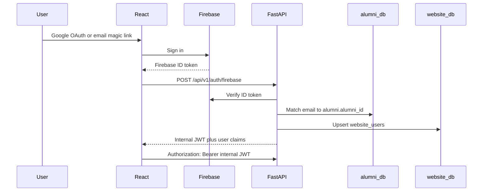
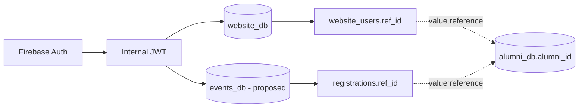

# Existing System Architecture Review for Event App Reuse

This document reviews the implemented NITKSAA Website and NITKSAA Admin Portal patterns that the future Event App and Event Admin system must reuse. It is intentionally a reference document only. No migrations, code, services, or UI changes are implemented here.

## 1. Existing Infrastructure Overview

### System Inventory

| System | Observed Location | Backend | Frontend | Deployment Shape |
|---|---|---|---|---|
| NITKSAA Website | `nitksaa-website` | FastAPI in `backend/server.py` | React/Vite in `frontend/src` | Single Cloud Run container serving API plus built SPA |
| NITKSAA Admin Portal | `nitksaa-portal-v2` | FastAPI in `webapp/backend/main.py` | React/Vite in `webapp/frontend/src` | Single Cloud Run container serving API plus built SPA |

### Firebase Projects

Both systems point at the same Firebase project ID:

```text
project-d22bed42-f302-4e23-8dc
```

Observed usage:

- Website backend verifies Firebase ID tokens via Firebase Admin SDK using Application Default Credentials.
- Website frontend initializes Firebase from Vite variables in `frontend/src/firebase.js`.
- Admin Portal backend also initializes Firebase with Application Default Credentials.
- Admin Portal frontend uses the same Firebase web app config pattern.

Event App requirement:

- Reuse the same Firebase project.
- Reuse the same Firebase UID as the stable identity key.
- Do not introduce separate credentials, a second Firebase project, or a second user namespace.

### Cloud Run Services

Observed Cloud Run hostnames in tenant/domain configuration:

- Website demo: `demo-nitksaa-website-246773894709.asia-south1.run.app`
- Website production: `nitksaa-website-246773894709.asia-south1.run.app`

The Admin Portal is packaged for Cloud Run with the same pattern, though the exact deployed hostname was not present in the inspected configuration.

Recommended Event App services:

- `nitksaa-events-api` or `nitksaa-events` for the user-facing Event App.
- `nitksaa-events-admin` only if operationally necessary. Prefer one backend with separate routes and role gates if that matches deployment and security needs.
- Same region as existing services: `asia-south1`.
- Same service account model: Application Default Credentials for Firebase Admin and Cloud SQL Unix socket access.

### Cloud SQL Usage

Observed Cloud SQL instance connection name:

```text
project-d22bed42-f302-4e23-8dc:asia-south1:nitksaa-alumni-db
```

Observed databases:

- `alumni_db`: alumni identity source of truth.
- `website_db`: website platform records such as users, communities, stories, mentorship, career, contact requests.

Required new database:

- `events_db`: event domain tables only.

Event App data rule:

- `events_db.registrations.ref_id` must store the alumni ID value from `alumni_db.alumni.alumni_id`.
- This is a value reference only.
- Do not create cross-database foreign keys.

### Hosting Setup

Both existing apps use a single container pattern:

1. Build React/Vite frontend in a Node stage.
2. Install Python dependencies in a Python runtime stage.
3. Copy backend source.
4. Copy frontend build output into the backend image.
5. Serve `/assets` and a SPA catch-all from FastAPI.
6. Run Uvicorn on Cloud Run's `$PORT`.

Website:

- Static assets mounted from `frontend/dist/assets`.
- SPA fallback serves `frontend/dist/index.html`.
- API docs are exposed at `/api/docs`.

Admin Portal:

- Static assets copied into backend `static`.
- SPA fallback serves `static/index.html`.
- API docs are exposed at `/api/docs`.

Event App should reuse this packaging model unless a clear operational reason emerges to split frontend hosting from backend deployment.

### Domains and Subdomains

Observed tenant resolution is host-based in the Website:

- `backend/src/config/tenants.yaml`
- `TenantMiddleware` resolves tenant from the `Host` header.
- Unknown hosts return `400`.

Current tenant entries include localhost, Cloud Run demo, and Cloud Run production hostnames.

Event App recommendation:

- Add explicit event domains/subdomains to the same tenant configuration approach if the event backend shares the tenant resolver.
- If Event App is a separate Cloud Run service, keep a tenant/domain config with the same shape.
- Avoid hardcoding environment-specific hostnames in application logic outside config.

### Environment Configs

Backend environment variables observed:

- `DB_HOST`
- `DB_PORT`
- `DB_NAME`
- `ALUMNI_DB_NAME` in Website
- `DB_USER`
- `DB_PASSWORD`
- `SECRET_KEY`
- `APP_ENV`
- `ALLOWED_ORIGINS`
- `FIREBASE_PROJECT_ID`
- Admin Portal also has `ADMIN_USERNAME`, `ADMIN_PASSWORD`, `ACCESS_TOKEN_EXPIRE_MINUTES`, `DB_SSLMODE`, `GMAIL_APP_PASSWORD`.

Frontend environment variables observed:

- `VITE_FIREBASE_API_KEY`
- `VITE_FIREBASE_AUTH_DOMAIN`
- `VITE_FIREBASE_PROJECT_ID`
- `VITE_FIREBASE_STORAGE_BUCKET`
- `VITE_FIREBASE_MESSAGING_SENDER_ID`
- `VITE_FIREBASE_APP_ID`
- `VITE_API_BASE_URL`

Event App recommendation:

- Reuse the exact Firebase frontend env names.
- Add `EVENTS_DB_NAME=events_db` on the backend.
- Keep `ALUMNI_DB_NAME=alumni_db`.
- Keep `SECRET_KEY` shared only if the Event App must accept existing Website JWTs directly. If JWT issuance remains centralized in the Website auth endpoint, Event App must validate with the same signing key and claim contract.

### Deployment Strategy

Observed strategy:

- Docker multi-stage builds.
- Cloud Run runtime.
- Cloud SQL Unix socket in production.
- Local development uses TCP Postgres host/port.
- Vite dev proxy points `/api` to local FastAPI.

No CI/CD workflow files were found in the inspected repos. Deployment may currently be manual or configured outside source control.

Event App recommendation:

- Reuse Docker multi-stage build.
- Reuse Cloud Run plus Cloud SQL socket connection.
- Keep build-time Firebase web config for Vite.
- Document and codify deployment scripts or CI before scaling more services.

## 2. Authentication Architecture

### Website Auth Flow

Website flow:



Key details:

- Firebase ID token is verified once during login.
- Internal JWT is issued by `make_jwt`.
- JWT expiry is 8 hours.
- JWT algorithm is `HS256`.
- Bearer token dependency is `get_current_user`.
- The backend decodes the internal JWT on each request, not the Firebase ID token.
- Website stores the JWT and user claims in `sessionStorage`.
- `auth.onAuthStateChanged` clears local JWT state when Firebase signs out.

JWT claims observed:

- `sub`
- `firebase_uid`
- `user_type`
- `ref_id`
- `is_admin`
- `is_content_editor`
- `graduation_year`
- `exp`

### Admin Portal Auth Flow

Admin Portal has two auth modes:

- Admin users: email/password plus TOTP, backed by `admin_users`.
- Alumni users: Firebase token exchange.

Admin JWT claims observed:

- `sub`
- `role`
- `user_id`
- `alumni_id`
- `firebase_uid`
- `fullname`
- `exp`

Admin roles observed:

- `super_admin`
- `staff_admin`
- `alumni`
- intermediate `totp_setup`

Admin Portal stores token and role in `localStorage`.

### User Roles

Website role model:

- `user_type`: especially `alumni` and `other`.
- `is_admin`: super/admin style access flag.
- `is_content_editor`: content review access flag.
- Community-specific admin role exists in `community_members.role`.

Admin Portal role model:

- `role`: `super_admin`, `staff_admin`, or `alumni`.
- TOTP is required for admin accounts.
- Super admin can create and manage admin users.

Event App recommendation:

- Use Firebase UID as identity.
- Use `ref_id` for alumni cross-reference.
- Reuse `website_users` as the primary user registry if Event App operates as part of the Website ecosystem.
- For Event Admin, decide whether to reuse Website's `is_admin` / `is_content_editor` flags or Admin Portal's `admin_users` roles. Do not create a third unrelated role model.
- Prefer a small event-specific permission table in `events_db` only for event-scoped roles, for example event organizer/check-in operator, keyed by `firebase_uid`.

### Token Validation and Middleware

Reusable patterns:

- `HTTPBearer` dependency.
- `get_current_user` dependency that returns a normalized user dict.
- `require_user_type(...)` or `require_role(...)` dependency factory.
- Suspension/active-status checks inside auth dependency.
- Route-level dependencies rather than ad hoc checks inside every endpoint.

What must be reused:

- Same Firebase project.
- Same Firebase UID.
- Same internal JWT issuer/secret if Event App accepts existing logged-in sessions.
- Same `Authorization: Bearer <jwt>` header convention.
- Same `ref_id` meaning: alumni ID from `alumni_db`.

What should not be duplicated:

- A separate Firebase app/project.
- A separate `events_users` identity table that duplicates `website_users`.
- A new JWT claim shape unless the existing claims are extended in a backward-compatible way.
- A parallel login UX that makes users re-register.

Recommended Event App auth approach:

1. Reuse the Website Firebase login/token exchange for user-facing Event App sessions.
2. Event App backend validates the same internal JWT and consumes `firebase_uid`, `user_type`, `ref_id`, `is_admin`, and `is_content_editor`.
3. Event App should require `user_type='alumni'` for alumni-only event registration features when needed.
4. Event Admin should require either existing `is_admin` or reused Admin Portal `super_admin` / `staff_admin` semantics. Pick one source of truth before implementation.
5. Event-scoped permissions should be additive and keyed by `firebase_uid`, not by new passwords.

## 3. Backend Architecture Review

### FastAPI Structure

Website structure:

```text
backend/
  server.py
  src/
    api/
    config/
    middleware/
    services/
```

Admin Portal structure:

```text
webapp/backend/
  main.py
  routers/
  config.py
  database.py
  dependencies.py
  models.py
```

The Website structure is more modular and should be the preferred model for the Event App because the new app must be part of the Website ecosystem.

Recommended Event backend structure:

```text
backend/src/
  api/events.py
  api/event_admin.py
  services/events_db.py or extend services/db.py
  services/alumni.py
  middleware/firebase.py
  config/settings.py
```

### Routers

Observed conventions:

- API routes use `/api/v1/...`.
- Each domain has its own `APIRouter`.
- Router docstrings summarize endpoint inventory.
- Static sub-routes are placed before dynamic routes to avoid route collisions.
- Related sub-routers can be registered separately when prefixes differ.

Event App should follow:

- User-facing routes: `/api/v1/events`.
- Admin routes: `/api/v1/events/admin` or `/api/v1/admin/events`.
- Keep static routes such as `/mine`, `/filters`, `/check-ins/summary` before `/{event_id}`.
- Use route tags consistently: `events`, `event-admin`, `check-ins`.

### Services

Reusable services:

- `backend/src/services/db.py`: connection pool context-manager style.
- `backend/src/services/alumni.py`: alumni identity lookup/caching pattern used by mentorship and career.
- Auth helpers in `backend/src/middleware/firebase.py`.

Event App should add an `events_db` pool while preserving the existing DB split:

- `get_db()` for `website_db`.
- `get_alumni_db()` for `alumni_db`.
- `get_events_db()` for `events_db`.

Do not query or mutate `alumni_db` except for read-only identity lookups or existing approved backfill patterns.

### Middleware

Website middleware:

- `TenantMiddleware` resolves tenant from host.
- Firebase auth is implemented as dependencies, not global middleware.

Admin Portal middleware:

- CORS middleware configured from allowed origins.

Event App should reuse:

- Host-based tenant resolution if it is served under tenant-specific domains.
- Dependency-based auth checks.
- CORS config if the Event App frontend is deployed separately during development.

### Dependency Injection

Reusable patterns:

- `Depends(get_current_user)` for any authenticated user.
- `Depends(require_user_type("alumni"))` for alumni-only access.
- `Depends(require_role("super_admin", "staff_admin"))` in Admin Portal.
- Small helper functions such as `_require_alumni` for local rule clarity.

Event App should keep permissions declarative at route boundaries and use helper functions only for domain-specific ownership checks.

### Config Management

Website:

- Pydantic Settings in `backend/src/config/settings.py`.
- `.env` file loaded from `backend/.env`.
- Production DB URLs use Cloud SQL Unix socket.
- Local DB URLs use TCP host/port.

Admin Portal:

- Pydantic Settings in `config.py`.
- Similar production/local DB split.

Event App should reuse Website config style and add:

- `events_db_name`.
- `events_db_url` property.
- Optional event-specific frontend URL origins if needed.

### Database Layer

Observed pattern:

- `psycopg2` with `RealDictCursor`.
- Connection pools cached for app process lifetime.
- Context managers commit on success and rollback on exception.
- SQL is written directly in router/service functions.
- Parameterized SQL is used.

Event App should:

- Use parameterized SQL.
- Keep SQL readable and close to route/service logic for now.
- Avoid introducing a new ORM unless the whole ecosystem moves together.
- Consider Admin Portal's semaphore pattern for pool exhaustion protection in high-traffic event check-in flows.

### Error Handling

Observed patterns:

- `HTTPException(status_code=..., detail="...")`.
- FastAPI validation errors are returned as `detail` arrays.
- Frontend `apiFetch` normalizes `detail`, `message`, and status.
- Conflict cases use 400/403/404/409 depending on semantics.

Event App should:

- Preserve FastAPI's `detail` error format.
- Use `401` for invalid/expired auth.
- Use `403` for valid user without permission.
- Use `404` for missing resources.
- Use `409` for duplicate registration, capacity reached, already checked in, or invalid state transitions.

### Logging

Admin Portal has explicit `logging.basicConfig` and `logger`.
Website has limited explicit logging in the inspected files.

Event App should add structured, minimal logging for:

- registration creation/cancellation
- payment/webhook state if payments are later added
- check-in attempts
- admin mutations
- capacity conflicts

Avoid logging tokens, Firebase ID tokens, JWTs, or PII beyond necessary identifiers.

### API Versioning

All current domain APIs use `/api/v1`.

Event App must use `/api/v1` and should not introduce `/events-api` or unversioned routes.

## 4. Frontend Architecture Review

### Folder Structure

Website frontend:

```text
frontend/src/
  api.js
  firebase.js
  App.jsx
  constants/
  hooks/
  utils/
  styles/
  components/
    core/
    person/
    alumni/
    community/
    story/
    mentorship/
    career/
  pages/
```

This is the pattern the Event App should reuse.

Recommended Event frontend additions:

```text
frontend/src/constants/events.js
frontend/src/hooks/useEventFilters.js
frontend/src/components/events/EventCard.jsx
frontend/src/components/events/EventDetailModal.jsx
frontend/src/components/events/EventRegistrationModal.jsx
frontend/src/components/events/CheckInPanel.jsx
frontend/src/pages/EventsPage.jsx
frontend/src/pages/MyEventsPage.jsx
frontend/src/pages/EventAdminPage.jsx
```

### Routing

Website routing uses `BrowserRouter`, `Routes`, and guard components in `App.jsx`.

Reusable guards:

- `RequireAuth`
- `RequireAlumni`
- `RequireAdmin`

Event routes should be added under the same guard model:

- `/events`: authenticated or public depending on policy.
- `/events/mine`: authenticated, likely alumni.
- `/events/:slug`: authenticated or public depending on visibility.
- `/admin/events`: admin-only.

### Component Organization

Reusable Website core components:

- `PageHeader`
- `EntityCard`
- `EntityCollection`
- `EntityModal`
- `FilterSidebar`
- `ChannelList`
- `ControlledVocabPicker`

The Event App should build event-specific wrappers around these primitives rather than inventing new shells.

### Modal Architecture

Website primary modal pattern:

- `EntityModal` as a tabbed drawer shell.
- Escape key closes.
- Body scroll is locked while open.
- Click overlay closes.
- Header and tabs are passed as slots/props.

Admin Portal has older modal styles in admin pages. These should not be copied into Event App unless the Event Admin is deliberately matching the Admin Portal's older surfaces.

Event App rule:

- User-facing event detail and registration flows should use `EntityModal`.
- Admin create/edit flows should either use `EntityModal` or a single shared admin modal shell derived from it.
- Do not create another `.modal-overlay`, `.modal-close`, and custom modal layout per event page.

### FilterSidebar

Website `FilterSidebar` is generic and section-driven. Supported section types:

- `select`
- `chips`
- `decade-grid`

Event App should extend only if necessary:

- Event filters can use chips for status/type, select for location/category, and date range can be added as a deliberate new section type if needed.
- If date filters are needed, extend `FilterSidebar` once rather than creating event-only filter UI.

### useFilters Hook

Website `useFilters` centralizes:

- initial filter state from sections
- optional `sessionStorage` persistence
- debounced search
- API param generation
- active filter count
- reset behavior

Event App should add:

```text
useEventFilters -> useFilters(EVENT_FILTER_SECTIONS, 'nitksaa_filters_events')
```

Do not use ad hoc `useState` chains for event search/filter state.

### CSS Architecture

Website CSS:

- `tokens.css` contains CSS variables only.
- `global.css` contains reset, typography, buttons, forms, common layout, loading/error/empty states.
- Component CSS files are imported centrally in `main.jsx`.
- Theme uses `[data-theme="light"]` overrides.
- Color system is navy/gold with semantic variables.

Admin Portal CSS:

- Similar navy/gold token vocabulary.
- Some older page-specific and admin-specific styles exist.

Event App must:

- Reuse the Website `tokens.css` and `global.css` strategy.
- Prefer existing `.btn`, `.btn-primary`, `.btn-ghost`, `.card`, `.badge`, `.empty-state`, `.spinner`.
- Add `events.css` and component-specific event CSS only when existing components cannot cover the need.
- Avoid duplicate button systems, duplicate modal classes, and page-specific one-off styling.

### Theme System

Website theme:

- `useTheme` persists theme in `localStorage` under `nitksaa-theme`.
- Theme is applied to `document.documentElement.dataset.theme`.
- Default is dark.

Event App must reuse:

- Same storage key.
- Same `data-theme` attribute.
- Same CSS variables.
- Same Navbar theme toggle if the app shares the shell.

### Table/Grid Patterns

Website `EntityCollection` supports:

- grid view with cards
- table view with `tableColumns`
- loading skeletons
- error and empty states
- pagination
- optional sidebar

Admin Portal has `data-table` styles for dense admin tables.

Event App should:

- Use `EntityCollection` for event listing and attendee listing where possible.
- Use Admin Portal `data-table` style only for dense admin-only operational pages.
- Avoid building a third table/grid pattern.

### Form Patterns

Observed form conventions:

- Pydantic models validate server-side.
- Frontend uses controlled inputs.
- Shared input/select global styles.
- Submit errors displayed inline.
- Mutations use `POST`, `PATCH`, `DELETE`, or action-style `POST`.

Event App should:

- Use controlled forms.
- Enforce constraints server-side via Pydantic.
- Keep form labels, inputs, and button styling aligned with global CSS.
- Use modal forms for focused operations and full pages for dense admin workflows.

### API Hooks and Client

Website API client:

- Central `apiFetch` in `frontend/src/api.js`.
- Adds `Authorization: Bearer <jwt>`.
- Adds `Content-Type: application/json`.
- Clears JWT on `401`.
- Throws `ApiError`.

Event App must:

- Add event API functions to the same API client or an adjacent module with the same `apiFetch`.
- Do not call `fetch` directly from event components unless there is a clear special case such as file download.
- Preserve the same error behavior.

## 5. Database Architecture Review

### Current Database Split



Current usage:

- `alumni_db` is the source of truth for alumni records.
- `website_db` stores platform domain data and references alumni by `firebase_uid` or `ref_id`.
- Contact data has already been centralized in `website_db` for cross-app reuse.
- Admin Portal primarily manages `alumni_db` and uses `website_db` for shared contact tables.

### Naming Conventions

Observed table/column style:

- snake_case table and column names.
- Primary keys commonly use entity-specific names: `community_id`, `story_id`, `mentor_id`, `job_id`.
- Firebase identity columns use `firebase_uid` or `{role}_firebase_uid`.
- Alumni references use `ref_id` or `alumni_id`.
- Status fields are string enums at application level.
- Timestamps use `created_at`, `updated_at`, plus domain-specific timestamps.

Event App should follow:

- `event_id`, `session_id`, `registration_id`, `attendee_id`, `check_in_id`.
- `firebase_uid` for authenticated user identity.
- `ref_id` for alumni ID value copied from JWT/user profile.
- `created_at`, `updated_at`.
- Domain timestamps such as `starts_at`, `ends_at`, `registered_at`, `checked_in_at`, `cancelled_at`.

### Migration Strategy

No active migration framework was found in the inspected Website repo. README references `scripts/` and `database/migrations/`, but those folders were not present in this checkout.

Event App recommendation:

- Do not implement migrations yet.
- Before implementation, choose one migration location and naming convention.
- Recommended path: `database/migrations/events_db/`.
- Recommended file naming: `YYYYMMDDHHMM_events_initial_schema.sql`.
- Apply migrations manually or via a documented deploy step until CI/CD exists.
- Keep `events_db` migrations separate from `alumni_db` and `website_db`.

### Audit Fields

Observed audit/status patterns:

- `created_at`, `updated_at` are common.
- Admin Portal has `audit_log` with actor, role, action, resource, details, success, timestamp.
- Some domain transitions record `published_at`, `reviewed_at`, `resolved_at`, `expires_at`, `deactivated_at`.
- Admin users track `created_by`, `last_login`, failed login state.

Event App should include:

- `created_at` and `updated_at` on mutable tables.
- `created_by_firebase_uid` for admin-created events/sessions.
- `updated_by_firebase_uid` where admin edit audit is important.
- `cancelled_at`, `cancelled_by_firebase_uid` on registrations if cancellation is allowed.
- `checked_in_at`, `checked_in_by_firebase_uid` on check-in records.
- Optional `event_audit_log` if operational audit is more than simple table timestamps.

### Soft Delete Patterns

Observed patterns are mixed:

- Communities use `is_active`.
- Mentor profiles use `is_active` and `deactivated_at`.
- Jobs use lifecycle status (`active`, `filled`, `closed`, `expired`).
- Community memberships and channels are sometimes physically deleted.
- Contact requests/connections are physically deleted after expiry by health checks.

Event App recommendation:

- Use status-based lifecycle instead of hard deletes for business records.
- `events.status`: `draft`, `published`, `cancelled`, `archived`.
- `sessions.status`: `scheduled`, `cancelled`.
- `registrations.status`: `registered`, `cancelled`, `waitlisted`, `attended`, `no_show`.
- Physical deletes should be limited to drafts with no registrations or temporary records.

### Indexing Patterns

Observed query patterns:

- Pagination uses `LIMIT/OFFSET`.
- Count queries precede list queries.
- Filters often use exact status/type and range conditions.
- Search uses `LOWER(field) LIKE LOWER(%s)` or `ILIKE`.
- Sorts are usually timestamp descending or name ascending.

Event App should index:

- `events(status, starts_at)`.
- `events(slug) UNIQUE`.
- `sessions(event_id, starts_at)`.
- `registrations(event_id, firebase_uid) UNIQUE`.
- `registrations(event_id, ref_id)`.
- `registrations(status)`.
- `check_ins(event_id, checked_in_at)`.
- `check_ins(registration_id)`.
- `attendees(ref_id)` if attendee records are separate from registrations.

### UUID Strategy

Existing systems primarily use serial/integer IDs and external string IDs such as `ALUMNI-000001`. There is no strong existing UUID convention in the inspected code.

Event App recommendation:

- Use integer/bigserial IDs for internal relational tables to align with existing systems.
- Use `slug` for public event URLs.
- Use a short opaque check-in code or QR token only if needed for check-in flows.
- Do not introduce UUIDs unless a specific offline/mobile syncing requirement appears.

### Timestamp Conventions

Observed:

- SQL uses `NOW()` / `now()`.
- Backend serializes datetimes using `.isoformat()`.
- Expiry windows are represented as timestamps (`expires_at`).

Event App should:

- Store timestamps as `timestamptz`.
- Return ISO strings from API responses.
- Keep event display timezone explicit in frontend.
- Avoid date-only strings for event schedules unless the event truly has no time.

### Proposed `events_db` Structure

This is a proposed reference structure only. Do not implement migrations yet.

#### `events`

Purpose: top-level event record.

Recommended columns:

- `event_id bigserial primary key`
- `slug text unique not null`
- `title text not null`
- `description text`
- `venue_name text`
- `venue_address text`
- `city text`
- `country text`
- `starts_at timestamptz not null`
- `ends_at timestamptz`
- `timezone text not null default 'Asia/Kolkata'`
- `capacity integer`
- `registration_opens_at timestamptz`
- `registration_closes_at timestamptz`
- `status text not null`
- `visibility text not null default 'authenticated'`
- `created_by_firebase_uid text not null`
- `updated_by_firebase_uid text`
- `created_at timestamptz not null default now()`
- `updated_at timestamptz not null default now()`

#### `sessions`

Purpose: agenda sessions within an event.

Recommended columns:

- `session_id bigserial primary key`
- `event_id bigint not null`
- `title text not null`
- `description text`
- `speaker_name text`
- `location text`
- `starts_at timestamptz not null`
- `ends_at timestamptz`
- `capacity integer`
- `status text not null default 'scheduled'`
- `sort_order integer default 0`
- `created_at timestamptz not null default now()`
- `updated_at timestamptz not null default now()`

Use a normal foreign key to `events.event_id` because both tables live in `events_db`.

#### `registrations`

Purpose: user's event registration.

Recommended columns:

- `registration_id bigserial primary key`
- `event_id bigint not null`
- `firebase_uid text not null`
- `ref_id text`
- `email text`
- `fullname text`
- `status text not null default 'registered'`
- `source text default 'event_app'`
- `registered_at timestamptz not null default now()`
- `cancelled_at timestamptz`
- `cancelled_by_firebase_uid text`
- `created_at timestamptz not null default now()`
- `updated_at timestamptz not null default now()`

Important:

- `ref_id` stores `alumni_db.alumni.alumni_id` by value only.
- No cross-database foreign key.
- Unique constraint recommended: `(event_id, firebase_uid)`.
- Optional unique constraint: `(event_id, ref_id)` when `ref_id IS NOT NULL`.

#### `attendees`

Purpose: event-facing attendee profile snapshot or guest record, if registration needs attendee-level detail beyond the authenticated registrant.

Recommended columns:

- `attendee_id bigserial primary key`
- `registration_id bigint not null`
- `event_id bigint not null`
- `firebase_uid text`
- `ref_id text`
- `fullname text not null`
- `email text`
- `phone text`
- `attendee_type text not null default 'alumni'`
- `created_at timestamptz not null default now()`
- `updated_at timestamptz not null default now()`

If each registration always equals one authenticated attendee, this table can be deferred. Do not create it unless guest attendees, companions, speaker records, or imported attendees are required.

#### `check_ins`

Purpose: immutable check-in log.

Recommended columns:

- `check_in_id bigserial primary key`
- `event_id bigint not null`
- `session_id bigint`
- `registration_id bigint not null`
- `attendee_id bigint`
- `checked_in_by_firebase_uid text not null`
- `checked_in_at timestamptz not null default now()`
- `method text not null default 'manual'`
- `device_label text`
- `notes text`

Recommended uniqueness:

- For event-level check-in: unique `(event_id, registration_id)` when `session_id IS NULL`.
- For session-level check-in: unique `(session_id, registration_id)`.

## 6. API Design Standards

### Response Format

Observed response styles:

- Single objects return plain JSON objects.
- Lists often return `{items, total, page, limit}` equivalents.
- Directory: `{items, total, page, limit}` pattern with domain-specific item key.
- Career jobs: `{jobs, total, page, limit}`.
- Communities: `{total, sections}`.
- Success mutations often return `{status: "ok", ...}`.

Event App recommendation:

- Lists: return `{events, total, page, limit}` or `{registrations, total, page, limit}`.
- Mutations: return `{status: "ok", ...}`.
- Created resources should return the created resource ID and enough display data for immediate UI updates.

### Error Format

Use FastAPI standard:

```json
{ "detail": "Human or machine-readable error" }
```

For validation errors, allow FastAPI's array `detail`. Frontend already knows how to normalize this.

### Pagination Style

Observed styles:

- `page`
- `limit` or `page_size`
- `total`
- `LIMIT/OFFSET`

Event App should prefer Website style:

- Query params: `page`, `limit`.
- Response: `total`, `page`, `limit`.
- Use `limit` max bounds, likely `le=100` for user lists and `le=200` for admin operational tables.

### Filtering Patterns

Observed:

- Search param names: `search` in Website, `q` in Admin Portal.
- Entity filters use query params.
- Empty filters are omitted by frontend.
- Filter metadata endpoints exist, for example `/filters`.

Event App should use:

- `search` for consistency with Website pages.
- `status`, `city`, `date_from`, `date_to`, `visibility`, `event_type` as query params.
- `GET /api/v1/events/filters` if filter options are dynamic.

### Sorting Patterns

Observed sorting is currently mostly fixed in backend SQL.

Event App recommendation:

- Start with fixed sort orders:
  - user event directory: `starts_at ASC`
  - admin event list: `created_at DESC` or `starts_at DESC`
  - registrations: `registered_at DESC`
- Add `sort` only when the UI needs it.
- Validate allowed sort fields server-side.

### Auth Headers

Standard:

```text
Authorization: Bearer <internal_jwt>
Content-Type: application/json
```

Event App must use the same header behavior through `apiFetch`.

### API Naming Conventions

Use:

- Nouns for resources: `/events`, `/events/{event_id}/registrations`.
- Action routes for state transitions: `/events/{event_id}/publish`, `/registrations/{id}/cancel`, `/registrations/{id}/check-in`.
- `/mine` for current user's owned/current records.
- `/admin` prefix for admin-only operational views.

Avoid:

- unversioned routes
- mixed camelCase path names
- duplicate routes for the same vocabulary in separate domains

## 7. Deployment & DevOps Review

### Cloud Run Deployment

Reusable pattern:

- Multi-stage Docker build.
- Node 20 frontend build.
- Python backend runtime.
- Uvicorn server.
- `$PORT` from Cloud Run.
- Built SPA served by FastAPI.
- Cloud SQL Unix socket in production.

Event App should:

- Use the same image pattern.
- Use the same Cloud SQL instance connection.
- Use `events_db` as a new database in the same instance.
- Set memory/concurrency based on expected check-in traffic.

### CI/CD

No CI/CD files were found in the inspected repositories.

Recommendation before Event App implementation:

- Document the current manual deploy command if deployment is manual.
- Add a minimal CI check for frontend build and backend import/test.
- Add deployment workflow later once secrets and environments are clarified.

### Secrets Management

Observed:

- Backend secrets are environment variables.
- Production likely relies on Cloud Run env vars or Secret Manager.
- Firebase Admin uses Application Default Credentials.
- Vite Firebase web config is built into the frontend bundle.

Event App should:

- Store `DB_PASSWORD`, `SECRET_KEY`, and any email/payment secrets in Secret Manager.
- Do not commit `.env` files.
- Treat frontend Firebase web config as public client config, not as a backend secret.
- Use the same service account permissions model as existing Cloud Run services.

### Environment Handling

Current split:

- `APP_ENV=production` switches to Cloud SQL Unix socket.
- Development uses local host/port.
- Frontend dev uses Vite proxy.
- Production frontend can set `VITE_API_BASE_URL` or rely on same-origin API.

Event App recommendation:

- Same-origin API is preferred if frontend and backend are bundled.
- Use `VITE_API_BASE_URL` only for separate-host development or separate frontend hosting.
- Maintain `.env.local.template` for frontend and backend `.env.example` for backend.

### Staging vs Production

Existing tenant config includes demo and production Cloud Run domains.

Event App should:

- Have explicit staging/demo and production hostnames.
- Use the same Firebase project if required by identity continuity.
- Use separate database names or schemas only if staging data isolation is needed. Do not point staging writes at production `events_db`.

### Logging and Monitoring

Current logging is stronger in Admin Portal than Website.

Event App should add logs for:

- registration create/cancel
- check-in success/failure
- admin publish/cancel
- capacity/waitlist transitions
- unexpected DB errors

Use Cloud Run logs initially. Add alerting for elevated `5xx`, DB pool exhaustion, and check-in error spikes.

## 8. Performance & Scalability Review

### API Efficiency

Observed strengths:

- Connection pools are reused.
- Queries are parameterized.
- Directory-like APIs count and fetch paginated data.
- Alumni identity lookups are centralized for mentorship/career formatting.

Observed risks:

- Some endpoints perform cross-database lookups per page and need careful batching.
- Offset pagination can become expensive for very large admin lists.
- Health checks perform cleanup work in some systems.

Event App recommendations:

- Batch alumni identity enrichment by `firebase_uid` or `ref_id`.
- Avoid per-registration alumni DB calls in list endpoints.
- Keep check-in endpoints minimal and single-purpose.
- Do not run cleanup work on `/healthz`; reserve health endpoints for liveness.

### Frontend Performance

Observed strengths:

- Debounced search.
- Pagination.
- Skeleton loading states.
- Shared list components.

Event App recommendations:

- Debounce event search.
- Keep event cards light.
- Load detail and registration data when the modal/page opens.
- Do not fetch attendee lists on the public event directory.
- Use table views for admin attendee lists with server-side pagination.

### Unnecessary API Calls

Patterns to avoid:

- Re-fetching Firebase tokens for every API call.
- Fetching full event detail for every event card.
- Fetching alumni profile details for every registration row one by one.
- Polling check-in counts aggressively without need.

Recommended:

- Use JWT from session.
- Fetch aggregate counts with the event list if needed.
- Batch attendee identity lookup.
- Add explicit refresh buttons or modest polling only for live admin dashboards.

### Overseas Latency Concerns

Alumni may be worldwide while services are in `asia-south1`.

Recommendations:

- Minimize login round trips.
- Use list payloads that include enough display data.
- Cache static event/session data in frontend state during navigation.
- Keep images optimized if event banners are added.

### Caching Opportunities

Good candidates:

- Event list filters.
- Published event detail.
- Session schedule.
- Static vocabulary/status values.

Poor candidates:

- Registration status for current user.
- Capacity/waitlist state.
- Check-in state.

### Bundle Size Concerns

Existing Website dependencies are light. Admin Portal includes `recharts`.

Event App should:

- Avoid heavy calendar/map/chart libraries unless needed.
- Lazy-load Event Admin pages if they become large.
- Reuse existing components instead of importing a second UI framework.

## 9. UI/UX Consistency Rules

Mandatory rules for the Event App:

### Typography

- Use `--font-serif` for page headings.
- Use `--font-sans` for controls, body, tables, and labels.
- Page headings should use `PageHeader`.
- Do not introduce new font families.

### Spacing

- Use `.container` and `--container-max`.
- Respect `--nav-height`.
- Use the existing sticky page header/topbar model for directory-like pages.
- Avoid nested cards and floating page sections.

### Button Styles

- Primary action: `.btn.btn-primary`.
- Secondary action: `.btn.btn-ghost`.
- Destructive actions need one shared destructive style if not already present.
- Do not add multiple event-only button systems.
- Icon buttons should use a consistent icon pattern and accessible labels.

### Modal Behavior

- Use `EntityModal` behavior: Escape closes, overlay click closes, body scroll locks.
- Keep close button location consistent.
- Use tabs only when content naturally separates into sections.
- Registration confirmation should be focused and short.

### Responsive Breakpoints

- Reuse existing responsive behavior from `EntityCollection`, `FilterSidebar`, Navbar, and page layouts.
- Mobile filters should use the existing sidebar open/close pattern.
- Tables must remain usable on narrow screens through horizontal scroll or simplified rows.

### Dark/Light Theme Handling

- Use CSS variables only.
- All event CSS must work under default dark and `[data-theme="light"]`.
- Do not hardcode text colors where variables exist.
- Use semantic tokens for status colors and add light-theme overrides if new colors are introduced.

### Visual Cohesion

- Event App should feel like another NITKSAA module, not a separate product.
- Reuse navy/gold identity, PageHeader, Navbar, core cards, filters, modals, and table styles.
- Keep operational admin pages denser and quieter than user-facing pages.

## 10. Reusable Components Matrix

| Existing Component | Source App | Reusable? | Recommended Usage |
|---|---|---:|---|
| Firebase client setup | Website `frontend/src/firebase.js` | Yes | Reuse for Google/magic-link auth and same Firebase project config. |
| Internal JWT exchange | Website `backend/src/api/auth.py` | Yes | Event App should accept the same JWT contract or call the same exchange endpoint. |
| Auth dependency | Website `backend/src/middleware/firebase.py` | Yes | Reuse `get_current_user` and `require_user_type`; extend carefully for event roles. |
| Admin role dependency | Admin Portal `dependencies.py` | Partial | Reuse concepts if Event Admin adopts Admin Portal roles; avoid a third role system. |
| TenantMiddleware | Website `backend/src/middleware/tenant.py` | Yes | Use for host/domain-based tenant resolution if Event App has tenant domains. |
| DB connection pools | Website `backend/src/services/db.py` | Yes | Add `get_events_db()` following the same context-manager pattern. |
| Alumni identity service | Website `backend/src/services/alumni.py` | Yes | Batch-enrich registration/attendee lists without duplicating alumni data. |
| API client `apiFetch` | Website `frontend/src/api.js` | Yes | Add event API methods through the same client and error handling. |
| Auth guards | Website `frontend/src/App.jsx` | Yes | Reuse `RequireAuth`, `RequireAlumni`, `RequireAdmin` model for event routes. |
| Theme Provider / hook | Website `frontend/src/hooks/useTheme.js` | Yes | Reuse same storage key and `data-theme` mechanism. |
| Layout Shell / Navbar | Website `Navbar` and page shell | Yes | Event App routes should sit under the same ecosystem navigation model. |
| PageHeader | Website `components/core/PageHeader.jsx` | Yes | Use for Events, My Events, Event Admin pages. |
| Button styles | Website `global.css` | Yes | Use `.btn`, `.btn-primary`, `.btn-ghost`; do not duplicate. |
| Modal Shell | Website `components/core/EntityModal.jsx` | Yes | Use for event detail, registration, attendee detail, and focused admin dialogs. |
| FilterSidebar | Website `components/core/FilterSidebar.jsx` | Yes | Use for event filters; extend once if date range section is needed. |
| useFilters hook | Website `hooks/useFilters.js` | Yes | Create `useEventFilters` wrapper with `nitksaa_filters_events`. |
| EntityCard | Website `components/core/EntityCard.jsx` | Yes | Use as shell for event cards. |
| EntityCollection | Website `components/core/EntityCollection.jsx` | Yes | Use for event grids/tables and attendee/registration lists. |
| Data table style | Admin Portal `styles/admin.css` | Partial | Use for dense Event Admin tables only if aligned with Website CSS tokens. |
| Toast System | Not clearly present | No current source | If needed, add one shared toast system rather than page-local alerts. |
| ControlledVocabPicker | Website `components/core/ControlledVocabPicker.jsx` | Partial | Reuse if events need tags/categories from controlled vocabularies. |
| Contact/connection patterns | Website/Admin Portal contact APIs | Partial | Useful for attendee contact privacy rules; not directly part of event registration. |

## 11. Risk Areas

### Architectural Duplication Risk

Risk:

- Event App could become a third separate architecture beside Website and Admin Portal.

Mitigation:

- Use Website folder/component/backend conventions as the primary pattern.
- Reuse auth, DB pools, API client, design tokens, and component shells.
- Document every new shared primitive before adding it.

### Auth Inconsistency Risk

Risk:

- Website uses `sessionStorage` and claims like `user_type`/`ref_id`; Admin Portal uses `localStorage` and `role`/`alumni_id`.
- Event App could accidentally create a third token and role contract.

Mitigation:

- Decide up front which JWT contract Event App accepts.
- For user-facing Event App, prefer Website JWT contract.
- For Event Admin, explicitly choose Website admin flags or Admin Portal roles.
- Never add event-only credentials.

### CSS Fragmentation Risk

Risk:

- Event pages may add custom buttons, modals, tables, cards, and filters.

Mitigation:

- Start from `PageHeader`, `EntityCollection`, `EntityCard`, `EntityModal`, `FilterSidebar`, `.btn`, `.card`, `.badge`.
- Add event CSS only for event-specific content presentation.
- Review CSS before implementation for duplicate modal/button/table styles.

### DB Duplication Risk

Risk:

- Event App may copy alumni profile data into `events_db` or add cross-database foreign keys.

Mitigation:

- Store only `firebase_uid`, `ref_id`, and necessary event-time snapshots such as `fullname` and `email` when needed for operational continuity.
- Keep `ref_id` as a value reference only.
- Batch-read alumni details from `alumni_db` for display where live data is required.

### API Drift Risk

Risk:

- New endpoints may use different pagination, error, auth, and route naming conventions.

Mitigation:

- Use `/api/v1`.
- Use `Authorization: Bearer`.
- Use FastAPI `detail` errors.
- Use `page`/`limit` and `total`.
- Add Event API methods to the central API client.

### Deployment Drift Risk

Risk:

- Event App may deploy with a different hosting, secret, or DB access pattern.

Mitigation:

- Reuse Cloud Run, Docker multi-stage build, same Cloud SQL instance, same Firebase ADC model.
- Keep environment variables aligned with existing naming.
- Add deploy documentation before implementation.

### Check-In Scalability Risk

Risk:

- Event check-ins are bursty and may exhaust DB pools or create duplicate check-ins.

Mitigation:

- Use unique constraints for check-in idempotency.
- Keep check-in endpoint short and indexed.
- Consider Admin Portal semaphore pool pattern.
- Return `409` for already checked in rather than failing unpredictably.

## Future Implementation Guidance

Before Event App implementation begins:

1. Confirm the source of truth for Event Admin roles: Website admin flags or Admin Portal admin roles.
2. Confirm whether Event App is added into the Website service or deployed as a separate Cloud Run service.
3. Add `events_db` connection settings following Website `settings.py`.
4. Write migrations in a dedicated events migration folder, but do not mix them with `alumni_db` migrations.
5. Add event frontend routes using existing guards and shared components.
6. Extend `apiFetch` with event functions before building UI components.
7. Reuse core CSS and components first; add event-specific styles only after a reuse pass.

The guiding rule: Event App should be a new domain module in the NITKSAA ecosystem, not a parallel platform.
